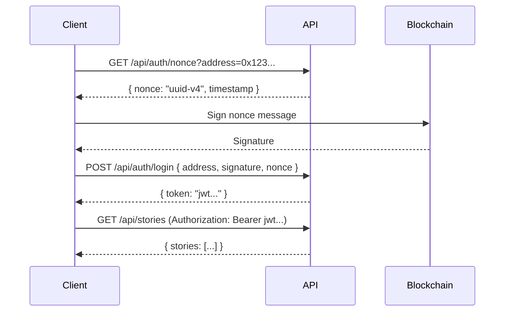

## Overview

eStory uses **Bearer token authentication** for all API routes. The API accepts two types of JWT tokens:

1. **Supabase Session JWT** — For users authenticated via Google OAuth
2. **Custom Wallet JWT** — For users authenticated via wallet signature

Both token types are validated by the `validateAuth()` and `validateAuthOrReject()` functions in `lib/auth.ts`.

## Authentication Flow

### Wallet Authentication

1. **Connect Wallet** — User connects via RainbowKit
2. **Request Nonce** — Client fetches a one-time nonce
3. **Sign Message** — User signs the nonce with their wallet
4. **Verify Signature** — Server verifies signature and issues JWT
5. **Store Token** — Client stores JWT in localStorage
6. **Use Token** — Client includes token in `Authorization` header



### Google OAuth Flow

1. **Sign in with Google** — User clicks OAuth button
2. **Redirect to Google** — User authorizes eStory
3. **Callback** — Supabase handles token exchange
4. **Session Created** — Supabase JWT stored automatically
5. **Use Token** — Client includes Supabase session token

## Request Header Format

Include the token in the `Authorization` header:

```http
Authorization: Bearer <your-jwt-token>
```

### Example Request

```javascript
const response = await fetch('https://your-domain.vercel.app/api/stories', {
  method: 'GET',
  headers: {
    'Authorization': `Bearer ${token}`,
    'Content-Type': 'application/json'
  }
});

const data = await response.json();
```

## Token Validation

The API uses two validation functions from `lib/auth.ts`:

### `validateAuth(request)`

Returns the user ID if the token is valid, or `null` if invalid.

```typescript
import { validateAuth } from "@/lib/auth";

export async function GET(req: NextRequest) {
  const userId = await validateAuth(req);
  if (!userId) {
    // Handle unauthenticated request (e.g., return public data)
  }
  // Continue with authenticated logic
}
```

### `validateAuthOrReject(request)`

Returns the user ID if valid, or a 401 response if invalid.

```typescript
import { validateAuthOrReject, isAuthError } from "@/lib/auth";

export async function POST(req: NextRequest) {
  const authResult = await validateAuthOrReject(req);
  if (isAuthError(authResult)) return authResult;
  
  const userId = authResult; // Type: string
  // Continue with authenticated logic
}
```

<Note>
  Use `validateAuthOrReject()` for routes that require authentication. Use `validateAuth()` for optional authentication (e.g., public feeds with personalized data for logged-in users).
</Note>

## Token Types

### Supabase Session JWT

Generated by Supabase Auth when users sign in via Google OAuth.

**Validation:**
- Verified using Supabase Admin Client (`supabase.auth.getUser(token)`)
- Contains user ID in `user.id` field
- Expires based on Supabase session configuration

**Format:** Standard JWT with Supabase claims

### Custom Wallet JWT

Generated by eStory server after verifying wallet signature.

**Validation:**
- Verified using `verifyWalletToken()` from `lib/jwt.ts`
- Contains `userId` in payload
- Signed with server secret (`JWT_SECRET` env var)

**Payload:**
```json
{
  "userId": "uuid-v4",
  "walletAddress": "0x...",
  "iat": 1234567890,
  "exp": 1234654290
}
```

## Ownership Verification

After authenticating the user, many endpoints verify that the user owns the resource they're trying to access.

### `validateWalletOwnership(userId, walletAddress)`

Verifies that the user owns the specified wallet address.

```typescript
import { validateWalletOwnership } from "@/lib/auth";

export async function POST(req: NextRequest) {
  const authResult = await validateAuthOrReject(req);
  if (isAuthError(authResult)) return authResult;
  const userId = authResult;

  const { walletAddress } = await req.json();

  const isOwner = await validateWalletOwnership(userId, walletAddress);
  if (!isOwner) {
    return NextResponse.json({ error: "Forbidden" }, { status: 403 });
  }

  // Continue with wallet operation
}
```

### Story Ownership Check

Verify the user owns a story before allowing modifications:

```typescript
const { data: story } = await supabase
  .from("stories")
  .select("author_id")
  .eq("id", storyId)
  .single();

if (story.author_id !== userId) {
  return NextResponse.json({ error: "Forbidden" }, { status: 403 });
}
```

## User ID Resolution

### `resolveUserId(authenticatedUserId)`

Resolves JWT user ID to the effective users-table ID.

**Why needed:** Wallet JWT users may have a different ID than OAuth users. This function ensures the correct ID is used for database queries.

```typescript
import { resolveUserId } from "@/lib/auth";

export async function GET(req: NextRequest) {
  const authResult = await validateAuthOrReject(req);
  if (isAuthError(authResult)) return authResult;

  // Resolve JWT user ID → users table ID
  const userId = await resolveUserId(authResult);

  // Use userId for database queries
  const { data } = await supabase
    .from("stories")
    .select("*")
    .eq("author_id", userId);
}
```

## Error Responses

### 401 Unauthorized

Returned when the token is missing, invalid, or expired.

```json
{
  "error": "Unauthorized"
}
```

### 403 Forbidden

Returned when the user is authenticated but lacks permission.

```json
{
  "error": "Forbidden"
}
```

## Security Best Practices

<Warning>
  - **Never expose tokens in URLs** — Always use the `Authorization` header
  - **Store tokens securely** — Use `localStorage` or secure cookies
  - **Rotate tokens** — Implement token refresh for long-lived sessions
  - **Verify ownership** — Always check that users own the resources they access
</Warning>

### Nonce Security

Nonces are used to prevent replay attacks during wallet authentication:

- **One-time use** — Each nonce can only be used once
- **5-minute expiry** — Nonces expire 5 minutes after generation
- **UUID v4** — Cryptographically random, collision-resistant
- **Timestamp included** — Message includes timestamp to prevent time-based attacks

### Token Security

- **HTTPS only** — Tokens should only be transmitted over HTTPS in production
- **Short expiry** — Tokens expire after a reasonable time (configurable)
- **Secure storage** — Never log or expose tokens in client-side code
- **Server-side validation** — All token validation happens server-side

## Helper Functions

### `isAuthError(result)`

Type guard to check if `validateAuthOrReject()` returned an error response.

```typescript
import { validateAuthOrReject, isAuthError } from "@/lib/auth";

export async function POST(req: NextRequest) {
  const authResult = await validateAuthOrReject(req);
  if (isAuthError(authResult)) {
    // authResult is NextResponse (error)
    return authResult;
  }
  // authResult is string (userId)
  const userId = authResult;
}
```

## Example: Protected API Route

Here's a complete example of a protected API route with ownership verification:

```typescript
import { NextRequest, NextResponse } from "next/server";
import { validateAuthOrReject, isAuthError, resolveUserId } from "@/lib/auth";
import { createSupabaseAdminClient } from "@/app/utils/supabase/supabaseAdmin";

export async function POST(req: NextRequest) {
  // 1. Validate authentication
  const authResult = await validateAuthOrReject(req);
  if (isAuthError(authResult)) return authResult;

  // 2. Resolve user ID
  const userId = await resolveUserId(authResult);

  // 3. Parse request body
  const { storyId, content } = await req.json();

  // 4. Verify ownership
  const supabase = createSupabaseAdminClient();
  const { data: story } = await supabase
    .from("stories")
    .select("author_id")
    .eq("id", storyId)
    .single();

  if (!story || story.author_id !== userId) {
    return NextResponse.json({ error: "Forbidden" }, { status: 403 });
  }

  // 5. Perform operation
  const { data, error } = await supabase
    .from("stories")
    .update({ content })
    .eq("id", storyId)
    .select()
    .single();

  if (error) {
    console.error("[API] Update error:", error);
    return NextResponse.json({ error: "Failed to update story" }, { status: 500 });
  }

  return NextResponse.json({ success: true, data });
}
```

## Next Steps

<CardGroup cols={2}>
  <Card title="Rate Limits" icon="gauge" href="/api/rate-limits">
    Learn about rate limiting policies
  </Card>
  <Card title="Error Handling" icon="triangle-exclamation" href="/api/error-handling">
    Handle authentication errors gracefully
  </Card>
</CardGroup>