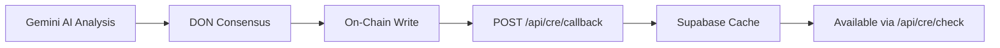

<Warning>
  **Internal use only.** This endpoint is called by Chainlink DON nodes, not by clients or frontend code. It is documented here for completeness and troubleshooting.
</Warning>

## Endpoint

<RequestExample>
```bash cURL
curl -X POST https://your-domain.com/api/cre/callback \
  -H "X-CRE-Callback-Secret: YOUR_SECRET" \
  -H "Content-Type: application/json" \
  -d '{
    "storyId": "123e4567-e89b-12d3-a456-426614174000",
    "significanceScore": 85,
    "emotionalDepth": 4,
    "qualityScore": 82,
    "wordCount": 1247,
    "themes": ["resilience", "family", "personal growth"],
    "qualityTier": 4,
    "meetsQualityThreshold": true,
    "metricsHash": "0x9876543210fedcba...",
    "txHash": "0xabcdef1234567890..."
  }'
```
</RequestExample>

## Authentication

<ParamField header="X-CRE-Callback-Secret" type="string" required>
  Secret token for authenticating DON node callbacks (set via `CRE_CALLBACK_SECRET` env var)
</ParamField>

<Warning>
  This endpoint uses **secret header authentication**, not Bearer tokens. The secret is shared with the Chainlink DON during workflow deployment.
</Warning>

## Request Body

<ParamField body="storyId" type="string" required>
  UUID of the story that was verified
</ParamField>

<ParamField body="significanceScore" type="number" required>
  AI-computed significance score (0-100)
</ParamField>

<ParamField body="emotionalDepth" type="number" required>
  Emotional depth rating (1-5)
</ParamField>

<ParamField body="qualityScore" type="number" required>
  Overall quality score (0-100)
</ParamField>

<ParamField body="wordCount" type="number" required>
  Exact word count from AI analysis
</ParamField>

<ParamField body="themes" type="string[]" required>
  List of detected narrative themes
</ParamField>

<ParamField body="qualityTier" type="number" required>
  Quality tier (1-5) for on-chain storage
</ParamField>

<ParamField body="meetsQualityThreshold" type="boolean" required>
  Whether quality score >= 70
</ParamField>

<ParamField body="metricsHash" type="string">
  Cryptographic hash of metrics for verification
</ParamField>

<ParamField body="txHash" type="string">
  Blockchain transaction hash of the on-chain attestation
</ParamField>

## Response

<ResponseField name="success" type="boolean">
  Always returns `true` for DON consensus (even on errors)
</ResponseField>

<ResponseExample>
```json Response
{
  "success": true
}
```
</ResponseExample>

<Note>
  This endpoint **always returns success** to ensure DON consensus isn't disrupted by transient errors. Failures are logged server-side for debugging.
</Note>

## Behavior

### Idempotency

Each DON node calls this endpoint independently, so it must be **idempotent**:

- Uses `upsert` on `story_id` to handle duplicate calls
- Multiple DON nodes calling with the same data = same result
- Last write wins (all writes have identical data due to DON consensus)

### Data Validation

Defense-in-depth metric clamping:

```typescript
significanceScore: clamp(0, 100)
emotionalDepth: clamp(1, 5)
qualityScore: clamp(0, 100)
wordCount: max(0, value)
qualityTier: clamp(1, 5)
themes: filter strings, max 10 items
```

This prevents malformed data from DON nodes (e.g., due to bugs or edge cases).

### Database Operations

1. **Upsert to `verified_metrics` table** (Supabase)
   - Stores all AI metrics + hashes + tx hash
   - `onConflict: "story_id"` for idempotency

2. **Update `verification_logs` table**
   - Marks verification as `completed`
   - Updates timestamp

## Error Handling

- **Invalid secret**: Returns `success: true` (silent rejection to avoid info leakage)
- **Missing storyId**: Returns `success: true` (logs error server-side)
- **Database errors**: Returns `success: true` (logs error, doesn't disrupt consensus)

<Warning>
  Because this endpoint always returns success, you must check **server logs** for actual errors:
  
  ```
  [CRE/CALLBACK] Invalid callback secret
  [CRE/CALLBACK] Missing storyId in payload
  [CRE/CALLBACK] Supabase upsert error: ...
  ```
</Warning>

## Workflow Context

This endpoint is called by the CRE workflow after:

1. AI analysis completes in the secure enclave
2. DON nodes reach consensus on the results
3. On-chain attestation is published to PrivateVerifiedMetrics
4. **Then** each DON node calls this callback with full metrics



## Security Considerations

### Secret Management

- Set `CRE_CALLBACK_SECRET` in your `.env.local` (local) or Vercel env vars (production)
- Use a strong random secret (32+ characters)
- Share with Chainlink when deploying the CRE workflow
- Rotate periodically (requires redeploying the workflow)

### Timing-Safe Comparison

The endpoint uses `safeCompare()` from `lib/crypto.ts` to prevent timing attacks:

```typescript
import { safeCompare } from '@/lib/crypto';

if (!safeCompare(secret, CRE_CALLBACK_SECRET)) {
  // Reject (constant-time comparison)
}
```

### No User Context

This endpoint **does not use Bearer token authentication** because:

- Called by DON nodes, not users
- No user context available
- Secret header is sufficient for machine-to-machine auth

## Testing

To test the callback locally:

1. Set `CRE_CALLBACK_SECRET=test123` in `.env.local`
2. Trigger a verification via `POST /api/cre/trigger`
3. Simulate a callback:

```bash
curl -X POST http://localhost:3000/api/cre/callback \
  -H "X-CRE-Callback-Secret: test123" \
  -H "Content-Type: application/json" \
  -d @test-payload.json
```

4. Check Supabase `verified_metrics` table for the upserted record

<Note>
  In production, only Chainlink DON nodes should call this endpoint. Use firewall rules or Vercel IP allowlisting to restrict access if needed.
</Note>

## Troubleshooting

### Callback Not Received

- Check `verification_logs` table: status still `pending`?
- Verify `CRE_WORKFLOW_URL` is set correctly in `/api/cre/trigger`
- Check Chainlink DON logs for workflow execution errors
- Ensure your callback URL is publicly accessible (not localhost)

### Metrics Not Updating

- Check server logs for `[CRE/CALLBACK]` errors
- Verify secret matches between endpoint and DON workflow
- Check Supabase RLS policies on `verified_metrics` table
- Confirm DON nodes have consensus (not split-brain)

### Multiple Calls

- **Expected behavior**: Each DON node calls independently
- Upsert ensures last write wins (all have identical data)
- If data differs between calls → DON consensus issue (contact Chainlink support)

## Related Files

| File | Purpose |
|------|---------||
| `cre/iStory_workflow/httpCallback.ts` | CRE workflow code that calls this endpoint |
| `contracts/PrivateVerifiedMetrics.sol` | On-chain contract for minimal proofs |
| `app/api/cre/trigger/route.ts` | Initiates the workflow |
| `app/api/cre/check/route.ts` | Reads cached metrics |
| `lib/crypto.ts` | Timing-safe secret comparison |
