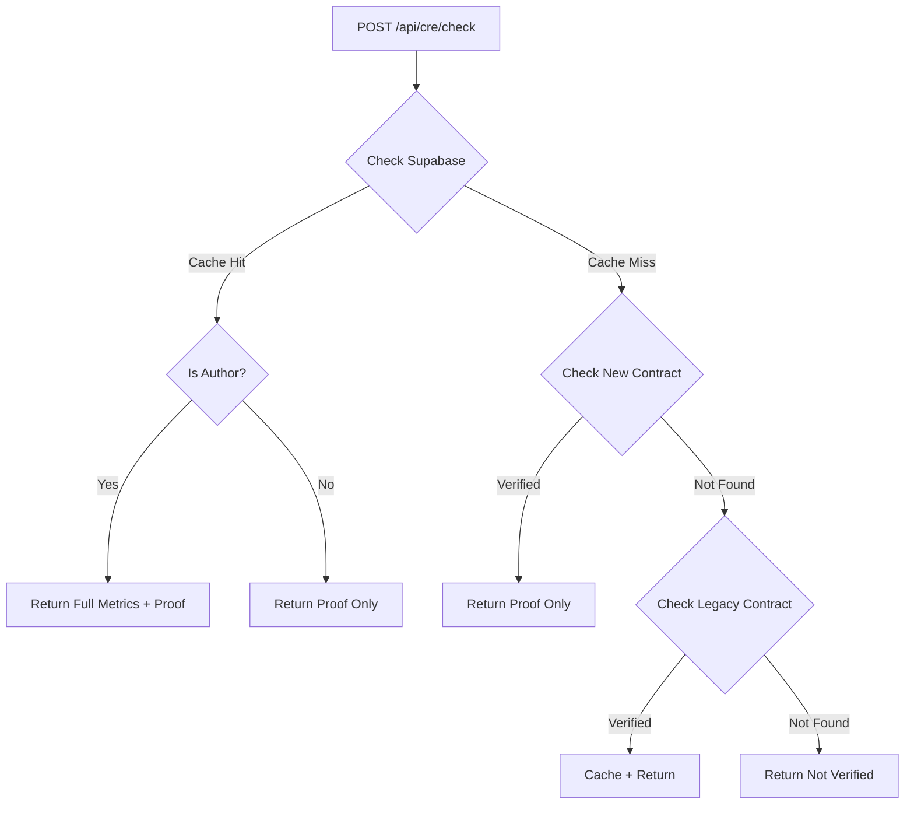

## Endpoint

<RequestExample>
```bash cURL
curl -X POST https://your-domain.com/api/cre/check \
  -H "Authorization: Bearer YOUR_TOKEN" \
  -H "Content-Type: application/json" \
  -d '{
    "storyId": "123e4567-e89b-12d3-a456-426614174000"
  }'
```
</RequestExample>

## Request

<ParamField body="storyId" type="string" required>
  The UUID of the story to check verification status and metrics for
</ParamField>

## Response (Author View)

When the authenticated user is the story author, full metrics are returned:

<ResponseField name="verified" type="boolean">
  Whether the story has been verified via CRE
</ResponseField>

<ResponseField name="isAuthor" type="boolean">
  Whether the authenticated user is the story author (true for author view)
</ResponseField>

<ResponseField name="metrics" type="object">
  Full AI analysis metrics (author-only)
  
  <ResponseField name="metrics.significance_score" type="number">
    Story significance score (0-100)
  </ResponseField>
  
  <ResponseField name="metrics.emotional_depth" type="number">
    Emotional depth rating (1-5)
  </ResponseField>
  
  <ResponseField name="metrics.quality_score" type="number">
    Overall quality score (0-100)
  </ResponseField>
  
  <ResponseField name="metrics.word_count" type="number">
    Exact word count from AI analysis
  </ResponseField>
  
  <ResponseField name="metrics.verified_themes" type="string[]">
    List of detected narrative themes
  </ResponseField>
  
  <ResponseField name="metrics.cre_attestation_id" type="string">
    Chainlink CRE attestation ID (bytes32 hex)
  </ResponseField>
  
  <ResponseField name="metrics.on_chain_tx_hash" type="string">
    Blockchain transaction hash of the on-chain attestation
  </ResponseField>
</ResponseField>

<ResponseField name="proof" type="object">
  Privacy-preserving on-chain proof (visible to all)
  
  <ResponseField name="proof.qualityTier" type="number">
    Quality tier (1-5): 1=Poor, 2=Fair, 3=Good, 4=Very Good, 5=Excellent
  </ResponseField>
  
  <ResponseField name="proof.meetsQualityThreshold" type="boolean">
    Whether quality score >= 70 (threshold for rewards/ranking)
  </ResponseField>
  
  <ResponseField name="proof.metricsHash" type="string">
    Cryptographic hash of full metrics for verification
  </ResponseField>
</ResponseField>

<ResponseExample>
```json Author Response
{
  "verified": true,
  "isAuthor": true,
  "metrics": {
    "significance_score": 85,
    "emotional_depth": 4,
    "quality_score": 82,
    "word_count": 1247,
    "verified_themes": ["resilience", "family", "personal growth"],
    "cre_attestation_id": "0x1234567890abcdef...",
    "on_chain_tx_hash": "0xabcdef1234567890..."
  },
  "proof": {
    "qualityTier": 4,
    "meetsQualityThreshold": true,
    "metricsHash": "0x9876543210fedcba..."
  }
}
```
</ResponseExample>

## Response (Public View)

When the authenticated user is **not** the story author, only proof is returned:

<ResponseExample>
```json Public Response
{
  "verified": true,
  "isAuthor": false,
  "proof": {
    "qualityTier": 4,
    "meetsQualityThreshold": true
  }
}
```
</ResponseExample>

<Note>
  This **author-based filtering** ensures privacy: specific scores and themes are only visible to the story author, while the public can verify quality tier and threshold status.
</Note>

## Response (Not Verified)

If the story has not been verified:

<ResponseExample>
```json Not Verified
{
  "verified": false
}
```
</ResponseExample>

## Data Sources

This endpoint reads from multiple sources in priority order:

1. **Supabase cache** (fast, full metrics from `/api/cre/callback`)
2. **PrivateVerifiedMetrics contract** (on-chain proof only)
3. **Legacy VerifiedMetrics contract** (backward compatibility for old stories)

### Data Flow Diagram



## Quality Tiers

| Tier | Score Range | Label |
|------|-------------|-------|
| 1 | 0-20 | Poor |
| 2 | 21-40 | Fair |
| 3 | 41-60 | Good |
| 4 | 61-80 | Very Good |
| 5 | 81-100 | Excellent |

<Note>
  **Quality Threshold (70)** is used for reward distribution and content ranking. Stories that meet the threshold are eligible for weekly $STORY token rewards.
</Note>

## Error Responses

| Status | Error | Description |
|--------|-------|-------------|
| 400 | Story ID is required | Missing `storyId` in request body |
| 401 | Unauthorized | Invalid or missing Bearer token |
| 500 | Internal server error | Database or blockchain read failed |

## Related Hooks

For client-side integration with automatic polling:

```typescript
import { useVerifiedMetrics } from '@/app/hooks/useVerifiedMetrics';

const { metrics, proof, verified, isAuthor, isLoading, refetch } = useVerifiedMetrics(storyId);

// Automatically polls every 10s until verification completes
```

## Privacy Model

### On-Chain (Public)
- Quality tier (1-5)
- Meets threshold (boolean)
- Metrics hash (for verification)
- Author commitment (privacy-preserving)
- Attestation ID
- Timestamp

### Off-Chain (Author-Only)
- Specific scores (significance, depth, quality)
- Word count
- Verified themes (list of strings)
- Full AI analysis results

<Warning>
  **Never share full metrics** from author view in public UI. Always check `isAuthor` before displaying sensitive scores and themes.
</Warning>

## Verification Integrity

You can verify the integrity of metrics using the `metricsHash`:

```typescript
import { keccak256, encodePacked } from 'viem';

const computedHash = keccak256(
  encodePacked(
    ['uint8', 'uint8', 'uint8', 'uint32'],
    [significanceScore, emotionalDepth, qualityScore, wordCount]
  )
);

// Compare computedHash with proof.metricsHash
const isValid = computedHash === proof.metricsHash;
```

## Legacy Contract Support

For stories verified before the PrivateVerifiedMetrics contract deployment, this endpoint automatically:

1. Reads from the old `VerifiedMetrics` contract
2. Caches results to Supabase
3. Applies the same author-based filtering
4. Returns a `legacy: true` flag

<Note>
  Legacy stories have full data on-chain (the old contract stored everything), but this endpoint still respects privacy by filtering responses based on authorship.
</Note>
