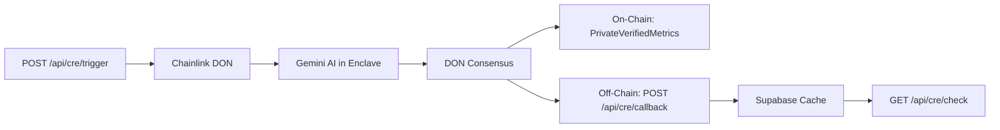

## Endpoint

<RequestExample>
```bash cURL
curl -X POST https://your-domain.com/api/cre/trigger \
  -H "Authorization: Bearer YOUR_TOKEN" \
  -H "Content-Type: application/json" \
  -d '{
    "storyId": "123e4567-e89b-12d3-a456-426614174000"
  }'
```
</RequestExample>

## Request

<ParamField body="storyId" type="string" required>
  The UUID of the story to verify via Chainlink CRE
</ParamField>

## Response

<ResponseField name="success" type="boolean">
  Indicates if the CRE workflow was initiated successfully
</ResponseField>

<ResponseField name="workflowRunId" type="string">
  Unique identifier for tracking this verification run
</ResponseField>

<ResponseField name="message" type="string">
  Human-readable status message ("Verification started")
</ResponseField>

<ResponseExample>
```json Response
{
  "success": true,
  "workflowRunId": "wf_1709510400123_x9k2j7a",
  "message": "Verification started"
}
```
</ResponseExample>

## What is CRE?

**Chainlink CRE (Compute Runtime Environment)** provides verifiable off-chain AI computation with on-chain attestation. For eStory, this means:

1. **Story content** is sent to a Chainlink Decentralized Oracle Network (DON)
2. **AI analysis** runs in a secure enclave (Gemini 2.5 Flash via ConfidentialHTTPClient)
3. **Consensus** is reached among DON nodes on the analysis results
4. **On-chain proof** is published to the PrivateVerifiedMetrics contract (minimal data: quality tier, threshold, hashes)
5. **Full metrics** are sent back to your backend via `/api/cre/callback` (author-only access)

## Workflow Steps

After triggering, the CRE workflow executes:

1. **DON receives** story content + metadata
2. **AI analyzes** content for significance, emotional depth, quality, themes, word count
3. **Cryptographic hashing** of metrics for verification
4. **Consensus** among DON nodes
5. **On-chain write** to PrivateVerifiedMetrics (privacy-preserving proof)
6. **Callback** to `/api/cre/callback` with full metrics
7. **Supabase cache** updated with results

<Note>
  The entire process typically takes **30-90 seconds** depending on story length and network congestion.
</Note>

## Verification Results

Once complete, you can fetch results via [`POST /api/cre/check`](/api/cre/check):

- **Authors** see full metrics (scores, themes, word count)
- **Public users** see proof only (quality tier, threshold met/not met)

## Prerequisites

- **Story must have content** (non-empty `content` field)
- **Author wallet required** (story must have `author_wallet` set)
- **Story not already verified** (prevents duplicate verification)
- **No pending verification** (one verification at a time per story)

## Error Responses

| Status | Error | Description |
|--------|-------|-------------|
| 400 | Story ID is required | Missing `storyId` in request body |
| 400 | Story has no content to verify | Story content is empty or whitespace-only |
| 400 | Author wallet address required | Story author hasn't connected a wallet |
| 401 | Unauthorized | Invalid or missing Bearer token |
| 403 | Forbidden | Authenticated user is not the story author |
| 404 | Story not found | No story exists with the given ID |
| 409 | Story already verified | Story already has verified metrics |
| 409 | Verification already in progress | Previous verification is still pending |
| 500 | Failed to start verification | Database or workflow trigger failed |

<Warning>
  Only the **story author** can trigger verification. This prevents abuse and ensures privacy — full metrics are author-only.
</Warning>

## Tracking Verification Status

You can poll the verification status:

```typescript
// Check verification_logs table for status
const { data } = await supabase
  .from('verification_logs')
  .select('status, workflow_run_id, updated_at')
  .eq('story_id', storyId)
  .order('created_at', { ascending: false })
  .limit(1)
  .single();

// status: "pending" | "completed" | "failed"
```

## Related Hooks

For client-side integration, use the `useVerifiedMetrics` hook:

```typescript
import { useVerifiedMetrics } from '@/app/hooks/useVerifiedMetrics';

const { triggerVerification, isLoading } = useVerifiedMetrics(storyId);
await triggerVerification();
```

## Architecture Diagram



<Note>
  This architecture ensures **privacy** (no full scores on-chain) and **verifiability** (cryptographic proofs + DON consensus).
</Note>
