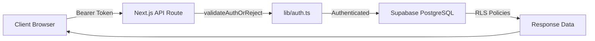

# System Architecture Overview

eStory is a Web3 AI-powered voice journaling dApp that transforms personal narratives into structured, sovereign memory infrastructure. Built on Base (Ethereum L2), it combines voice capture, AI transcription, blockchain permanence, and cognitive analysis.

## Architecture Layers

<CardGroup cols={2}>
  <Card title="Frontend Layer" icon="browser">
    Next.js 15 with React 19, Tailwind CSS 4, and shadcn/ui components
  </Card>
  <Card title="Web3 Layer" icon="ethereum">
    Wagmi, Viem, RainbowKit for wallet integration and blockchain interactions
  </Card>
  <Card title="Backend Layer" icon="server">
    Supabase (PostgreSQL) and Next.js API routes for serverless functions
  </Card>
  <Card title="AI Layer" icon="brain">
    ElevenLabs, Gemini, and Anthropic for voice transcription and analysis
  </Card>
</CardGroup>

## Provider Stack Architecture

The application uses a nested provider architecture defined in `components/Provider.tsx:84-98` that establishes the foundational context for the entire application:

```tsx
WagmiProvider
  → QueryClientProvider
    → ThemeProvider
      → RainbowKitProvider
        → BackgroundProvider
          → AuthProvider
            → AppContext
```

### Provider Hierarchy Breakdown

<Accordion title="WagmiProvider" icon="ethereum">
  **Purpose:** Web3 wallet connection and blockchain state management
  
  - Configures multi-chain support (Base Sepolia)
  - Manages wallet connections via RainbowKit
  - Provides hooks for contract interactions
  - Source: `components/Provider.tsx:85`
</Accordion>

<Accordion title="QueryClientProvider" icon="database">
  **Purpose:** React Query for server state management
  
  - Caches blockchain queries and API responses
  - Handles background refetching and invalidation
  - Powers Web3 hooks (useAccount, useBalance, useReadContract)
  - Source: `components/Provider.tsx:86`
</Accordion>

<Accordion title="ThemeProvider" icon="palette">
  **Purpose:** Dark/light mode theming via next-themes
  
  - Manages theme state (light, dark, system)
  - Persists user preference to localStorage
  - Provides theme context to all components
  - Source: `components/Provider.tsx:87`
</Accordion>

<Accordion title="RainbowKitProvider" icon="wallet">
  **Purpose:** Wallet UI and connection management
  
  - Renders wallet connection modal
  - Supports multiple wallet providers (MetaMask, WalletConnect, etc.)
  - Auto-adapts theme based on ThemeProvider
  - Source: `components/Provider.tsx:88` (via ThemedRainbowKit wrapper)
</Accordion>

<Accordion title="BackgroundProvider" icon="sparkles">
  **Purpose:** Three.js animated background rendering
  
  - Manages WebGL context for particle effects
  - Includes capability detection for low-powered devices
  - Dynamically loaded to reduce initial bundle size
  - Source: `components/Provider.tsx:89`
</Accordion>

<Accordion title="AuthProvider" icon="shield-check">
  **Purpose:** Authentication state management (dual OAuth + wallet)
  
  - Manages Supabase session (Google OAuth)
  - Handles wallet authentication tokens
  - Provides sign-in/sign-out methods
  - Coordinates vault key cleanup on sign-out
  - Source: `components/Provider.tsx:90`
</Accordion>

<Accordion title="AppContext" icon="user">
  **Purpose:** Application-level user state
  
  - Aggregates user data (address, balance, tokens, badges)
  - Provides wallet connection status
  - Integrates with AuthProvider for unified user context
  - Source: `components/Provider.tsx:38-70`
</Accordion>

<Note>
  The provider order is critical: outer providers must not depend on inner providers' context. For example, RainbowKitProvider needs theme context from ThemeProvider, so ThemeProvider wraps RainbowKit.
</Note>

## Data Flow Architecture

### Client → API → Database Flow



### Voice Recording Flow

<Steps>
  <Step title="Capture Audio">
    Browser MediaRecorder API captures user voice → generates audio blob
  </Step>
  <Step title="Upload to Storage">
    POST `/api/audio/upload` → Supabase Storage bucket `story-audio`
  </Step>
  <Step title="Transcribe">
    POST `/api/ai/transcribe` → ElevenLabs Scribe API → returns text
  </Step>
  <Step title="Enhance">
    POST `/api/ai/enhance` → Google Gemini 2.5 Flash → polished text
  </Step>
  <Step title="Save Story">
    POST `/api/journal/save` → Supabase `stories` table with audio URL
  </Step>
  <Step title="Analyze">
    POST `/api/ai/analyze` → Gemini extracts metadata → saved to `story_metadata`
  </Step>
</Steps>

### Blockchain Interaction Flow

```typescript
// Client-side contract interaction via Wagmi
import { useWriteContract } from 'wagmi'
import { eStoryTokenABI } from '@/lib/contracts'

const { writeContract } = useWriteContract()
await writeContract({
  address: ESTORY_TOKEN_ADDRESS,
  abi: eStoryTokenABI,
  functionName: 'mint',
  args: [recipientAddress, amount]
})
```

<Note>
  All blockchain writes happen client-side via Wagmi hooks. The server only verifies transaction hashes via `/api/sync/verify_tx` for reward distribution.
</Note>

## Application Routes

### Public Routes

| Route | Purpose | Metadata |
|-------|---------|----------|
| `/` | Landing page | Static SEO, branded OG image |
| `/story/[id]` | Public story detail | Dynamic OG image, JSON-LD schema |
| `/social` | Community feed | Discover public stories |

### Authenticated Routes

| Route | Purpose | Auth Required |
|-------|---------|---------------|
| `/record` | Voice recording | Yes (wallet or Google) |
| `/library` | Personal stories | Yes |
| `/profile` | User profile/settings | Yes |
| `/books/[id]` | Compiled book detail | Yes (author only) |

### API Route Categories

<CardGroup cols={2}>
  <Card title="AI Endpoints" icon="sparkles">
    `/api/ai/transcribe`, `/api/ai/enhance`, `/api/ai/analyze` — all require Bearer token auth
  </Card>
  <Card title="Auth Endpoints" icon="key">
    `/api/auth/login`, `/api/auth/nonce`, `/api/auth/onboarding` — wallet and OAuth flows
  </Card>
  <Card title="Story Endpoints" icon="book">
    `/api/journal/save`, `/api/stories/[id]/metadata` — story CRUD with ownership checks
  </Card>
  <Card title="Social Endpoints" icon="users">
    `/api/social/like`, `/api/social/follow`, `/api/tip` — community interactions
  </Card>
</CardGroup>

## State Management

<CardGroup cols={3}>
  <Card title="Server State" icon="server">
    **Tool:** React Query (TanStack Query)
    
    - Blockchain data (balances, contract reads)
    - API responses (stories, profiles)
    - Auto-refetching and cache invalidation
  </Card>
  
  <Card title="Client State" icon="browser">
    **Tool:** React Context + useState
    
    - AuthProvider (session, user)
    - AppContext (wallet state)
    - UI state (modals, toasts)
  </Card>
  
  <Card title="Local Storage" icon="hard-drive">
    **Tool:** Dexie.js (IndexedDB)
    
    - Encrypted local vault (AES-256-GCM)
    - Offline story drafts
    - Sync queue for cloud uploads
  </Card>
</CardGroup>

## Performance Architecture

### Bundle Optimization

- **First Load JS Target:** < 500 kB per page
- **Current Shared Chunk:** 104 kB (wagmi + viem + RainbowKit + react-query)
- **Optimizations Applied:**
  - `next.config.mjs` → `optimizePackageImports` for lucide-react, framer-motion, @radix-ui/*
  - Three.js background → dynamic import with `ssr: false`
  - Provider stack → wrapped with `ProvidersDynamic` to avoid hydration issues

### Code Splitting Strategy

```typescript
// Dynamic imports for heavy components
const BackgroundAnimation = dynamic(
  () => import('@/components/BackgroundAnimation'),
  { ssr: false } // Skip SSR for WebGL components
)
```

<Warning>
  The Web3 stack (wagmi + viem + RainbowKit) adds ~200 kB to all pages. This cannot be code-split without breaking wallet auth flow, which is required globally.
</Warning>

## Deployment Architecture

<CardGroup cols={2}>
  <Card title="Frontend" icon="globe">
    **Platform:** Vercel (recommended)
    
    - Automatic deployments from GitHub
    - Edge functions for API routes
    - Environment variables for secrets
    - Production: `npm run build` → `npm run start`
  </Card>
  
  <Card title="Smart Contracts" icon="ethereum">
    **Network:** Base Sepolia (testnet) / Base (mainnet)
    
    - Hardhat for deployment: `npx hardhat run scripts/deploy.ts`
    - Contract addresses stored in `lib/contracts.ts`
    - Verification: `npx hardhat run scripts/verify-deployment.ts`
  </Card>
</CardGroup>

## Directory Structure

```plaintext
i_story_dapp/
├── app/
│   ├── api/                      # API routes (serverless functions)
│   ├── hooks/                    # React hooks (useVault, useVerifiedMetrics)
│   ├── types/                    # TypeScript definitions
│   ├── utils/                    # Utilities (Supabase clients, services)
│   └── [pages]/                  # books, library, profile, record, social, story
├── components/                   # React components (ui/, vault/, Provider, Nav)
├── contracts/                    # Solidity smart contracts + CRE interfaces
├── lib/                          # Shared libraries (auth, crypto, contracts, vault/)
├── middleware.ts                 # API rate limiting
├── __tests__/                    # Unit tests (Vitest)
├── e2e/                          # E2E tests (Playwright)
└── docs/                         # Reference documentation
```

## Next Steps

<CardGroup cols={2}>
  <Card title="Technology Stack" icon="code" href="/architecture/tech-stack">
    Detailed breakdown of all frontend, Web3, backend, and AI technologies
  </Card>
  <Card title="Security Architecture" icon="shield" href="/architecture/security">
    5-layer security model, auth flows, and encryption architecture
  </Card>
  <Card title="Database Schema" icon="database" href="/architecture/database-schema">
    Supabase tables, RLS policies, indexes, and type definitions
  </Card>
</CardGroup>