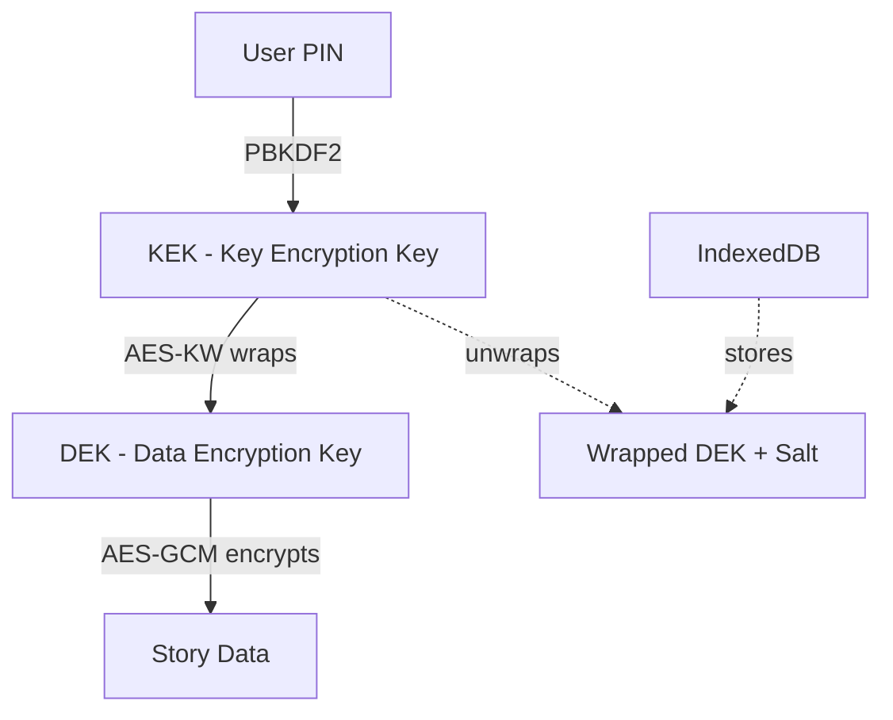

# Key Management

The vault key manager handles the full lifecycle of encryption keys: setup, unlock, lock, and PIN changes. Keys are held in-memory only while unlocked, and the PIN never persists anywhere.

## Key Hierarchy



**Key types:**
- **KEK (Key Encryption Key):** Derived from PIN using PBKDF2. Used to wrap/unwrap the DEK.
- **DEK (Data Encryption Key):** Random AES-256 key. Encrypts story data. Stored wrapped in IndexedDB.

## In-Memory Key Storage

The DEK is held in a `Map<userId, CryptoKey>` while the vault is unlocked:

```typescript
// Source: lib/vault/keyManager.ts:26-27
const dekMap = new Map<string, CryptoKey>();
```

<Warning>
**Security:** The DEK exists in plaintext only in memory. It's never written to disk. On sign-out or page unload, `clearAllKeys()` wipes the map.
</Warning>

## Vault Lifecycle

### 1. Setup Vault (First Use)

Generates a new DEK, wraps it with PIN-derived KEK, and stores the wrapped DEK in IndexedDB.

```typescript
// Source: lib/vault/keyManager.ts:32-67
export async function setupVault(userId: string, pin: string): Promise<void> {
  const db = getVaultDb();

  // Check if vault already exists
  const existing = await db.vaultKeys.get(userId);
  if (existing) {
    throw new Error("Vault already exists for this user");
  }

  // Generate fresh salt and DEK
  const salt = generateSalt();
  const dek = await generateDEK();

  // Derive KEK from PIN
  const kek = await derivePinKey(pin, salt);

  // Wrap DEK with KEK
  const wrappedDek = await wrapDEK(dek, kek);

  // Hash PIN for quick verification
  const pinHash = await hashPin(pin, salt);

  // Store in IndexedDB
  const record: VaultKeyRecord = {
    userId,
    salt: arrayBufferToBase64(salt.buffer),
    wrapped_dek: arrayBufferToBase64(wrappedDek),
    pin_hash: pinHash,
    created_at: new Date().toISOString(),
  };

  await db.vaultKeys.put(record);

  // Hold DEK in memory (vault is now unlocked)
  dekMap.set(userId, dek);
}
```

**Flow:**
1. Generate 16-byte random salt
2. Generate 256-bit random DEK
3. Derive KEK from PIN + salt (PBKDF2, 100K iterations)
4. Wrap DEK with KEK using AES-KW
5. Hash PIN for quick verification
6. Store `{ salt, wrapped_dek, pin_hash }` in IndexedDB
7. Add DEK to in-memory map (vault is unlocked)

### 2. Unlock Vault

Derives KEK from entered PIN, unwraps DEK, and loads it into memory.

```typescript
// Source: lib/vault/keyManager.ts:73-105
export async function unlockVault(
  userId: string,
  pin: string
): Promise<boolean> {
  const db = getVaultDb();

  const record = await db.vaultKeys.get(userId);
  if (!record) {
    throw new Error("No vault found for this user");
  }

  const salt = new Uint8Array(base64ToArrayBuffer(record.salt));

  // Quick PIN check
  const enteredHash = await hashPin(pin, salt);
  if (enteredHash !== record.pin_hash) {
    return false;
  }

  try {
    // Derive KEK and unwrap DEK
    const kek = await derivePinKey(pin, salt);
    const wrappedDek = base64ToArrayBuffer(record.wrapped_dek);
    const dek = await unwrapDEK(wrappedDek, kek);

    // Store in memory
    dekMap.set(userId, dek);
    return true;
  } catch {
    // Unwrap failed (shouldn't happen if PIN hash matched, but be safe)
    return false;
  }
}
```

**Flow:**
1. Retrieve vault record from IndexedDB
2. Quick PIN verification using SHA-256 hash
3. Derive KEK from PIN + stored salt
4. Unwrap DEK using KEK (AES-KW)
5. Add DEK to in-memory map
6. Return `true` on success, `false` on wrong PIN

<Note>
The PIN hash check avoids expensive PBKDF2 derivation on every failed attempt. If the hash doesn't match, return immediately.
</Note>

### 3. Lock Vault

Removes the DEK from memory, rendering all encrypted data inaccessible.

```typescript
// Source: lib/vault/keyManager.ts:110-112
export function lockVault(userId: string): void {
  dekMap.delete(userId);
}
```

**When to lock:**
- User clicks "Lock Vault" button
- App is sent to background (mobile)
- Inactivity timeout (configurable)

### 4. Check Vault Status

Two helper functions check vault state:

```typescript
// Source: lib/vault/keyManager.ts:117-128
export async function isVaultSetup(userId: string): Promise<boolean> {
  const db = getVaultDb();
  const record = await db.vaultKeys.get(userId);
  return !!record;
}

export function isVaultUnlocked(userId: string): boolean {
  return dekMap.has(userId);
}
```

**Usage:**
```typescript
if (!await isVaultSetup(userId)) {
  // Show vault setup flow
} else if (!isVaultUnlocked(userId)) {
  // Show unlock PIN prompt
} else {
  // Vault is ready
}
```

### 5. Get DEK

Retrieves the in-memory DEK for encryption/decryption operations.

```typescript
// Source: lib/vault/keyManager.ts:133-139
export function getDEK(userId: string): CryptoKey {
  const dek = dekMap.get(userId);
  if (!dek) {
    throw new Error("Vault is locked — unlock with PIN first");
  }
  return dek;
}
```

<Warning>
**Always check unlock status** before calling `getDEK()`. If the vault is locked, this throws an error.
</Warning>

## PIN Change Flow

Re-wraps the DEK with a new KEK derived from the new PIN. **Does not re-encrypt stories.**

```typescript
// Source: lib/vault/keyManager.ts:145-181
export async function changePin(
  userId: string,
  oldPin: string,
  newPin: string
): Promise<void> {
  const db = getVaultDb();

  const record = await db.vaultKeys.get(userId);
  if (!record) {
    throw new Error("No vault found for this user");
  }

  // Verify old PIN
  const salt = new Uint8Array(base64ToArrayBuffer(record.salt));
  const oldHash = await hashPin(oldPin, salt);
  if (oldHash !== record.pin_hash) {
    throw new Error("Incorrect current PIN");
  }

  // Get current DEK from memory
  const dek = getDEK(userId);

  // Generate new salt for new PIN
  const newSalt = generateSalt();
  const newKek = await derivePinKey(newPin, newSalt);
  const newWrappedDek = await wrapDEK(dek, newKek);
  const newPinHash = await hashPin(newPin, newSalt);

  // Update record
  await db.vaultKeys.put({
    userId,
    salt: arrayBufferToBase64(newSalt.buffer),
    wrapped_dek: arrayBufferToBase64(newWrappedDek),
    pin_hash: newPinHash,
    created_at: record.created_at,
  });
}
```

**Flow:**
1. Verify old PIN
2. Retrieve DEK from memory (vault must be unlocked)
3. Generate new salt
4. Derive new KEK from new PIN + new salt
5. Re-wrap DEK with new KEK
6. Compute new PIN hash
7. Update IndexedDB record

<Accordion title="Why not re-encrypt all stories?">
The DEK doesn't change — only the wrapping key (KEK) changes. All story ciphertexts remain valid. This makes PIN changes instant, even with thousands of stories.
</Accordion>

## AES-KW Key Wrapping

**AES Key Wrap (RFC 3394)** encrypts the DEK with the KEK, ensuring the DEK is never stored in plaintext.

```typescript
// Source: lib/vault/crypto.ts:91-114
export async function wrapDEK(
  dek: CryptoKey,
  kek: CryptoKey
): Promise<ArrayBuffer> {
  return crypto.subtle.wrapKey("raw", dek, kek, "AES-KW");
}

export async function unwrapDEK(
  wrappedDek: ArrayBuffer,
  kek: CryptoKey
): Promise<CryptoKey> {
  return crypto.subtle.unwrapKey(
    "raw",
    wrappedDek,
    kek,
    "AES-KW",
    { name: "AES-GCM", length: 256 },
    true, // extractable for re-wrapping on PIN change
    ["encrypt", "decrypt"]
  );
}
```

**Why AES-KW?**
- NIST-approved standard (SP 800-38F)
- Integrity protection (unwrap fails if tampered)
- Deterministic (same KEK + DEK = same wrapped output)

## Clear All Keys (Sign-Out)

Wipes all DEKs from memory. Called by `AuthProvider` on sign-out.

```typescript
// Source: lib/vault/keyManager.ts:225-227
export function clearAllKeys(): void {
  dekMap.clear();
}
```

**When to call:**
- User signs out
- Auth session expires
- App is closed (browser `beforeunload` event)

## Cloud Backup (Future)

Export/import wrapped key material for multi-device sync:

```typescript
// Source: lib/vault/keyManager.ts:186-220
export async function getWrappedKeyMaterial(
  userId: string
): Promise<{ salt: string; wrappedDek: string } | null> {
  const db = getVaultDb();
  const record = await db.vaultKeys.get(userId);
  if (!record) return null;
  return {
    salt: record.salt,
    wrappedDek: record.wrapped_dek,
  };
}

export async function importWrappedKeyMaterial(
  userId: string,
  salt: string,
  wrappedDek: string,
  pin: string
): Promise<void> {
  const pinHash = await hashPin(
    pin,
    new Uint8Array(base64ToArrayBuffer(salt))
  );

  const db = getVaultDb();
  await db.vaultKeys.put({
    userId,
    salt,
    wrapped_dek: wrappedDek,
    pin_hash: pinHash,
    created_at: new Date().toISOString(),
  });
}
```

<Note>
**Security:** The exported material is still PIN-protected. Without the PIN, the wrapped DEK is useless.
</Note>

## File Reference

**Location:** `~/workspace/source/lib/vault/keyManager.ts`

**Exports:**
- `setupVault` — First-time vault creation
- `unlockVault` — Derive KEK, unwrap DEK, load into memory
- `lockVault` — Remove DEK from memory
- `isVaultSetup` — Check if vault exists
- `isVaultUnlocked` — Check if DEK is in memory
- `getDEK` — Retrieve in-memory DEK
- `changePin` — Re-wrap DEK with new KEK
- `clearAllKeys` — Wipe all DEKs from memory
- `getWrappedKeyMaterial` / `importWrappedKeyMaterial` — Cloud backup helpers

---

**Related:**
- [Encryption](/architecture/vault/encryption) — Crypto primitives
- [Storage](/architecture/vault/storage) — IndexedDB schema
