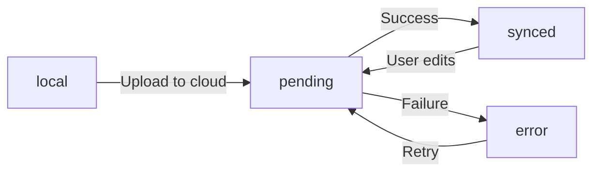

# IndexedDB Storage

eStory's local vault uses **Dexie.js** (IndexedDB wrapper) to store encrypted story records, vault keys, and sync queue operations. All sensitive data is encrypted at rest.

## Database Schema

### Tables

```typescript
// Source: lib/vault/db.ts:70-84
class VaultDatabase extends Dexie {
  stories!: EntityTable<LocalStoryRecord, "localId">;
  vaultKeys!: EntityTable<VaultKeyRecord, "userId">;
  syncQueue!: EntityTable<SyncQueueRecord, "id">;

  constructor() {
    super("estory-vault");

    this.version(1).stores({
      stories: "localId, userId, sync_status, updated_at, cloud_id",
      vaultKeys: "userId",
      syncQueue: "++id, storyLocalId, userId, status",
    });
  }
}
```

**Database name:** `estory-vault`

<Accordion title="stories — Encrypted story records">
**Primary key:** `localId` (UUID)

**Indexes:**
- `userId` — Filter by user
- `sync_status` — Filter by sync state (local, pending, synced, error)
- `updated_at` — Sort by modification time
- `cloud_id` — Reverse lookup after cloud sync

**Encrypted fields:**
- `encrypted_title` + `title_iv`
- `encrypted_content` + `content_iv`
- `encrypted_audio` + `audio_iv` (optional)
- `encrypted_metadata` + `metadata_iv` (optional)

**Plaintext fields:**
- `localId`, `userId`, `cloud_id`, `sync_status`, `is_public`, `story_date`, `created_at`, `updated_at`, `checksum`
</Accordion>

<Accordion title="vaultKeys — Per-user key material">
**Primary key:** `userId`

**Fields:**
- `salt` — PBKDF2 salt (base64)
- `wrapped_dek` — AES-KW wrapped DEK (base64)
- `pin_hash` — SHA-256 PIN hash for quick verification
- `created_at` — Timestamp

**Security:**
- DEK never stored in plaintext
- PIN never stored (only hash)
- Salt is unique per user
</Accordion>

<Accordion title="syncQueue — Pending cloud operations">
**Primary key:** `id` (auto-increment)

**Indexes:**
- `storyLocalId` — Which story needs syncing
- `userId` — Filter by user
- `status` — Filter by pending/processing/failed

**Fields:**
- `action` — "upload", "update", "delete"
- `status` — "pending", "processing", "failed"
- `retryCount` — Number of retry attempts
- `lastAttempt` — Last sync attempt timestamp
- `error` — Error message on failure
</Accordion>

## Record Types

### LocalStoryRecord

Encrypted story with metadata:

```typescript
// Source: lib/vault/db.ts:16-43
export interface LocalStoryRecord {
  localId: string;
  userId: string;
  /** Encrypted title (base64) */
  encrypted_title: string;
  title_iv: string;
  /** Encrypted content (base64) */
  encrypted_content: string;
  content_iv: string;
  /** Encrypted audio blob (base64), optional */
  encrypted_audio?: string;
  audio_iv?: string;
  /** Encrypted metadata JSON (base64) — mood, tags, etc. */
  encrypted_metadata?: string;
  metadata_iv?: string;
  /** SHA-256 hash of plaintext for integrity check */
  checksum: string;
  /** Cloud story ID after sync */
  cloud_id?: string;
  /** Sync state */
  sync_status: SyncStatus;
  /** Whether story is public */
  is_public: boolean;
  /** User-selected story date */
  story_date: string;
  created_at: string;
  updated_at: string;
}
```

**Checksum:** SHA-256 of `title + content` (plaintext) for integrity verification.

### VaultKeyRecord

Vault key material:

```typescript
// Source: lib/vault/db.ts:45-54
export interface VaultKeyRecord {
  userId: string;
  /** PBKDF2 salt (base64) */
  salt: string;
  /** AES-KW wrapped DEK (base64) */
  wrapped_dek: string;
  /** SHA-256 PIN hash for quick verification */
  pin_hash: string;
  created_at: string;
}
```

### SyncQueueRecord

Pending sync operation:

```typescript
// Source: lib/vault/db.ts:56-66
export interface SyncQueueRecord {
  id?: number; // Auto-incremented
  storyLocalId: string;
  userId: string;
  action: "upload" | "update" | "delete";
  status: "pending" | "processing" | "failed";
  retryCount: number;
  lastAttempt?: string;
  error?: string;
  created_at: string;
}
```

## Singleton Database Instance

```typescript
// Source: lib/vault/db.ts:86-94
let _db: VaultDatabase | null = null;

export function getVaultDb(): VaultDatabase {
  if (!_db) {
    _db = new VaultDatabase();
  }
  return _db;
}
```

**Usage:**
```typescript
import { getVaultDb } from "@/lib/vault";

const db = getVaultDb();
const stories = await db.stories.where("userId").equals(userId).toArray();
```

<Note>
The singleton pattern ensures only one database connection is active, preventing lock conflicts.
</Note>

## Reactive CRUD with useLiveQuery

The `useLocalStories` hook uses Dexie's `useLiveQuery` for automatic UI updates when IndexedDB changes.

### Query Stories

```typescript
// Source: app/hooks/useLocalStories.ts:61-73
const encryptedRecords = useLiveQuery(
  async () => {
    if (!userId) return [];
    const db = getVaultDb();
    return db.stories
      .where("userId")
      .equals(userId)
      .reverse()
      .sortBy("updated_at");
  },
  [userId],
  []
);
```

**Behavior:**
- Re-runs query whenever `stories` table is modified
- Returns empty array while loading
- Automatically triggers React re-render

### Decrypt Stories

```typescript
// Source: app/hooks/useLocalStories.ts:76-140
useEffect(() => {
  if (!userId || !encryptedRecords || encryptedRecords.length === 0) {
    setDecryptedStories([]);
    setIsLoading(false);
    return;
  }

  if (!isVaultUnlocked(userId)) {
    setDecryptedStories([]);
    setIsLoading(false);
    return;
  }

  let mounted = true;

  (async () => {
    try {
      setIsLoading(true);
      const dek = getDEK(userId);
      const results: DecryptedStory[] = [];

      for (const record of encryptedRecords) {
        try {
          const title = await decryptString(record.encrypted_title, record.title_iv, dek);
          const content = await decryptString(record.encrypted_content, record.content_iv, dek);

          let metadata: Record<string, unknown> | undefined;
          if (record.encrypted_metadata && record.metadata_iv) {
            const metaJson = await decryptString(record.encrypted_metadata, record.metadata_iv, dek);
            metadata = JSON.parse(metaJson);
          }

          results.push({
            localId: record.localId,
            title,
            content,
            metadata,
            cloud_id: record.cloud_id,
            sync_status: record.sync_status,
            is_public: record.is_public,
            story_date: record.story_date,
            created_at: record.created_at,
            updated_at: record.updated_at,
          });
        } catch (decryptErr) {
          console.error(`[useLocalStories] Failed to decrypt story ${record.localId}:`, decryptErr);
        }
      }

      if (mounted) {
        setDecryptedStories(results);
        setError(null);
      }
    } catch (err) {
      console.error("[useLocalStories] Decryption error:", err);
      if (mounted) setError("Failed to decrypt local stories");
    } finally {
      if (mounted) setIsLoading(false);
    }
  })();

  return () => {
    mounted = false;
  };
}, [userId, encryptedRecords]);
```

**Flow:**
1. Check if vault is unlocked
2. Retrieve DEK from memory
3. Decrypt each record's title, content, metadata
4. Build `DecryptedStory[]` array
5. Update state (triggers re-render)

<Warning>
**Performance:** Decryption runs on every `encryptedRecords` change. For large vaults (1000+ stories), consider pagination or virtual scrolling.
</Warning>

### Save Story

```typescript
// Source: app/hooks/useLocalStories.ts:142-206
const saveStory = useCallback(
  async (params: SaveStoryParams): Promise<string> => {
    if (!userId) throw new Error("Not signed in");
    if (!isVaultUnlocked(userId)) throw new Error("Vault is locked");

    const dek = getDEK(userId);
    const now = new Date().toISOString();
    const localId = crypto.randomUUID();

    const encTitle = await encryptString(params.title, dek);
    const encContent = await encryptString(params.content, dek);

    let encAudio: string | undefined;
    let audioIv: string | undefined;
    if (params.audioBlob) {
      const audioBuffer = await params.audioBlob.arrayBuffer();
      const { ciphertext, iv } = await encryptData(audioBuffer, dek);
      encAudio = arrayBufferToBase64(ciphertext);
      audioIv = arrayBufferToBase64(iv.buffer);
    }

    let encMeta: string | undefined;
    let metaIv: string | undefined;
    if (params.metadata) {
      const metaResult = await encryptString(JSON.stringify(params.metadata), dek);
      encMeta = metaResult.ciphertext;
      metaIv = metaResult.iv;
    }

    // Compute checksum of plaintext for integrity
    const encoder = new TextEncoder();
    const checksumData = encoder.encode(params.title + params.content);
    const hashBuffer = await crypto.subtle.digest(
      "SHA-256",
      checksumData as unknown as BufferSource
    );
    const checksum = arrayBufferToBase64(hashBuffer);

    const record: LocalStoryRecord = {
      localId,
      userId,
      encrypted_title: encTitle.ciphertext,
      title_iv: encTitle.iv,
      encrypted_content: encContent.ciphertext,
      content_iv: encContent.iv,
      encrypted_audio: encAudio,
      audio_iv: audioIv,
      encrypted_metadata: encMeta,
      metadata_iv: metaIv,
      checksum,
      cloud_id: params.cloud_id,
      sync_status: params.sync_status ?? "local",
      is_public: params.is_public,
      story_date: params.story_date,
      created_at: now,
      updated_at: now,
    };

    const db = getVaultDb();
    await db.stories.put(record);

    return localId;
  },
  [userId]
);
```

**Flow:**
1. Validate vault is unlocked
2. Encrypt title, content, audio (if present), metadata (if present)
3. Compute SHA-256 checksum of plaintext
4. Build `LocalStoryRecord`
5. Write to IndexedDB (triggers `useLiveQuery` update)
6. Return generated `localId`

### Delete Story

```typescript
// Source: app/hooks/useLocalStories.ts:242-247
const deleteStory = useCallback(
  async (localId: string) => {
    if (!userId) throw new Error("Not signed in");
    const db = getVaultDb();
    await db.stories.delete(localId);
  },
  [userId]
);
```

### Update Sync Status

```typescript
// Source: app/hooks/useLocalStories.ts:251-263
const updateSyncStatus = useCallback(
  async (localId: string, status: SyncStatus, cloudId?: string) => {
    if (!userId) throw new Error("Not signed in");
    const db = getVaultDb();
    const update: Partial<LocalStoryRecord> = {
      sync_status: status,
      updated_at: new Date().toISOString(),
    };
    if (cloudId !== undefined) update.cloud_id = cloudId;
    await db.stories.update(localId, update);
  },
  [userId]
);
```

## useLocalStories Hook

Reactive hook for encrypted CRUD operations:

```typescript
// Source: app/hooks/useLocalStories.ts:31-39
export interface UseLocalStoriesResult {
  stories: DecryptedStory[];
  isLoading: boolean;
  error: string | null;
  saveStory: (params: SaveStoryParams) => Promise<string>;
  getDecryptedStory: (localId: string) => Promise<DecryptedStory | null>;
  deleteStory: (localId: string) => Promise<void>;
  updateSyncStatus: (localId: string, status: SyncStatus, cloudId?: string) => Promise<void>;
}
```

**Usage:**
```typescript
import { useLocalStories } from "@/app/hooks/useLocalStories";

function MyComponent() {
  const { stories, isLoading, saveStory } = useLocalStories();

  const handleSave = async () => {
    const localId = await saveStory({
      title: "My Story",
      content: "Story text...",
      is_public: false,
      story_date: new Date().toISOString(),
    });
    console.log("Saved:", localId);
  };

  if (isLoading) return <div>Loading...</div>;

  return (
    <div>
      {stories.map(story => (
        <div key={story.localId}>{story.title}</div>
      ))}
    </div>
  );
}
```

<Note>
**Automatic decryption:** The hook decrypts stories automatically when the vault is unlocked. If the vault is locked, `stories` will be empty.
</Note>

## Sync Status Flow



**Sync states:**
- `local` — Never synced to cloud
- `pending` — Queued for upload
- `synced` — Cloud and local match
- `error` — Sync failed (retryable)

## File References

**Schema:**
- `~/workspace/source/lib/vault/db.ts` — Dexie schema, record types

**Hook:**
- `~/workspace/source/app/hooks/useLocalStories.ts` — Reactive CRUD operations

**Related:**
- `lib/vault/crypto.ts` — Encryption primitives
- `lib/vault/keyManager.ts` — DEK management

---

**Related:**
- [Encryption](/architecture/vault/encryption) — AES-256-GCM details
- [Key Management](/architecture/vault/key-management) — DEK lifecycle
