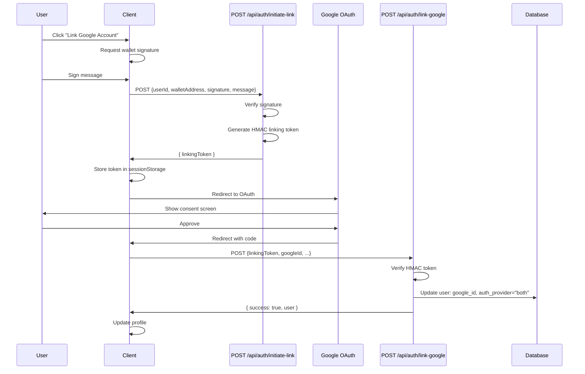
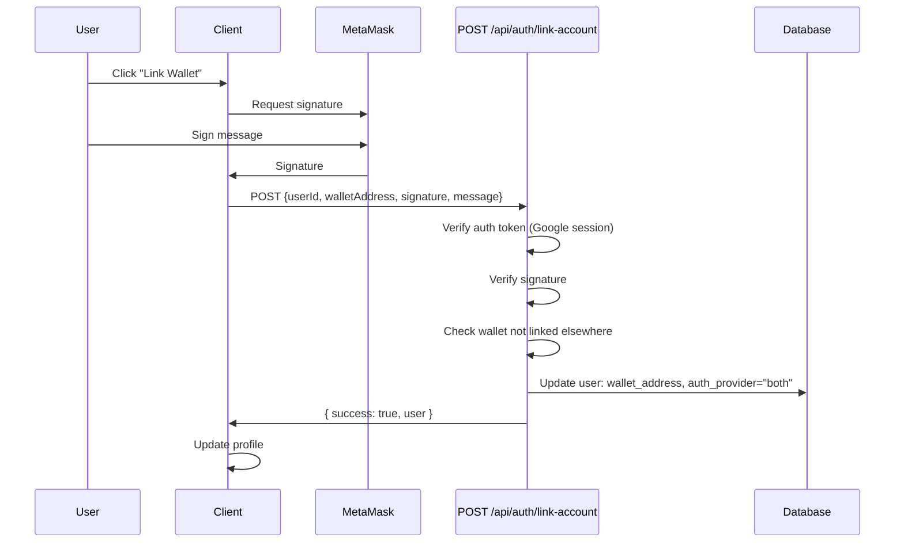

## Overview

eStory allows users to **link their Google and wallet accounts** to enjoy the best of both worlds: Web3 features (NFTs, tokens, on-chain attestations) and traditional social login convenience.

### Why Account Linking?

<CardGroup cols={2}>
  <Card title="Unified Identity" icon="user">
    Single profile combines wallet address and Google email/name
  </Card>
  <Card title="Flexible Login" icon="arrows-left-right">
    Sign in with either method and access the same account
  </Card>
  <Card title="Web3 Features" icon="ethereum">
    Google users can add a wallet to mint NFTs, send tips, etc.
  </Card>
  <Card title="Account Recovery" icon="shield">
    If you lose access to one auth method, you still have the other
  </Card>
</CardGroup>

## Linking Flows

eStory supports **two linking directions**:

1. **Wallet → Google**: Wallet user adds Google OAuth
2. **Google → Wallet**: Google user adds a wallet

Both flows use **HMAC-signed linking tokens** to prevent account takeover attacks.

## Wallet → Google Flow

A user who authenticated with their wallet wants to add Google OAuth.

### Flow Diagram



### Step 1: Initiate Linking

The client requests a secure linking token after obtaining a wallet signature.

#### POST /api/auth/initiate-link

**Endpoint**: `source/app/api/auth/initiate-link/route.ts`

**Request**:
```typescript
POST /api/auth/initiate-link
Content-Type: application/json

{
  "userId": "user-uuid",
  "walletAddress": "0x742d35cc6634c0532925a3b844bc9e7595f0beb",
  "signature": "0x7f8c9d2e...",
  "message": "Link Google account to wallet 0x742d35cc..."
}
```

**Response**:
```json
{
  "success": true,
  "linkingToken": "eyJ1c2VySWQiOiJ1c2VyLXV1aWQiLCJ3YWxsZXRBZGRyZXNzIjoiMHg3NDJkMzVjYy4uLiIsInRpbWVzdGFtcCI6MTcwOTQ3MjAwMDAwMH0.aGJjZGVmZ2hpamtsbW5vcHFyc3R1dnd4eXo"
}
```

**Implementation**:

<Steps>
  <Step title="Validate Input">
    ```typescript
    const { userId, walletAddress, signature, message } = await req.json();
    
    if (!userId || !walletAddress || !signature || !message) {
      return NextResponse.json(
        { error: "Missing required fields" },
        { status: 400 }
      );
    }
    ```
  </Step>
  
  <Step title="Verify Signature">
    Prove the user controls the wallet:
    
    ```typescript
    import { verifyMessage, type Address } from "viem";
    
    const isValid = await verifyMessage({
      address: walletAddress as Address,
      message,
      signature: signature as `0x${string}`,
    });
    
    if (!isValid) {
      return NextResponse.json(
        { error: "Signature verification failed" },
        { status: 401 }
      );
    }
    ```
  </Step>
  
  <Step title="Verify User Ownership">
    Ensure the user actually owns this wallet:
    
    ```typescript
    const admin = createSupabaseAdminClient();
    const { data: user } = await admin
      .from("users")
      .select("id, wallet_address, auth_provider, google_id")
      .eq("id", userId)
      .single();
    
    if (!user) {
      return NextResponse.json({ error: "User not found" }, { status: 404 });
    }
    
    if (user.wallet_address?.toLowerCase() !== walletAddress.toLowerCase()) {
      return NextResponse.json(
        { error: "Wallet address does not match user" },
        { status: 403 }
      );
    }
    ```
  </Step>
  
  <Step title="Check Existing Link">
    Prevent duplicate linking:
    
    ```typescript
    if (user.google_id || user.auth_provider === "both") {
      return NextResponse.json(
        { error: "Google account already linked" },
        { status: 409 }
      );
    }
    ```
  </Step>
  
  <Step title="Generate Linking Token">
    Create an HMAC-signed token with 10-minute expiry:
    
    ```typescript
    import { createLinkingToken } from "@/app/utils/linkingToken";
    
    const token = createLinkingToken(userId, walletAddress);
    // Token format: base64url(payload).base64url(hmac_signature)
    
    return NextResponse.json({ success: true, linkingToken: token });
    ```
  </Step>
</Steps>

### Linking Token Structure

The linking token is an **HMAC-signed JWT-like structure** (source/app/utils/linkingToken.ts:16):

```typescript
interface LinkingTokenPayload {
  userId: string;           // User ID to link
  walletAddress: string;    // Lowercase wallet address
  timestamp: number;        // Token creation time (for expiry check)
}

// Token format: base64url(payload).base64url(hmac_signature)
function createLinkingToken(userId: string, walletAddress: string): string {
  const payload: LinkingTokenPayload = {
    userId,
    walletAddress: walletAddress.toLowerCase(),
    timestamp: Date.now(),
  };
  
  const payloadStr = JSON.stringify(payload);
  const payloadB64 = Buffer.from(payloadStr).toString("base64url");
  
  // HMAC-SHA256 signature
  const hmac = crypto.createHmac("sha256", SECRET);
  hmac.update(payloadB64);
  const signature = hmac.digest("base64url");
  
  return `${payloadB64}.${signature}`;
}
```

**Security Properties**:
- **Integrity**: HMAC signature prevents tampering
- **Time-bound**: 10-minute expiry (checked during verification)
- **Single-use**: Token is consumed after successful linking
- **Server-secret**: Only the server can create/verify tokens

<Warning>
The linking token is stored in **sessionStorage** (not localStorage) to limit its lifetime to a single browser tab session. If the user closes the tab before completing OAuth, the token is lost (by design).
</Warning>

### Step 2: Start Google OAuth

After receiving the linking token, the client stores it and redirects to Google:

```typescript
// Client-side flow
async function linkGoogleAccount() {
  const { profile } = useAuth();
  const { signMessageAsync } = useSignMessage();
  
  // 1. Sign a message to prove wallet ownership
  const message = `Link Google account to wallet ${profile.wallet_address}`;
  const signature = await signMessageAsync({ message });
  
  // 2. Request linking token
  const res = await fetch("/api/auth/initiate-link", {
    method: "POST",
    headers: { "Content-Type": "application/json" },
    body: JSON.stringify({
      userId: profile.id,
      walletAddress: profile.wallet_address,
      signature,
      message,
    }),
  });
  
  const { linkingToken } = await res.json();
  
  // 3. Store token in sessionStorage (short-lived)
  sessionStorage.setItem("googleLinkingToken", linkingToken);
  sessionStorage.setItem("googleLinkingUserId", profile.id);
  
  // 4. Redirect to Google OAuth
  await supabase.auth.signInWithOAuth({
    provider: "google",
    options: {
      redirectTo: `${window.location.origin}/api/auth/callback`,
    },
  });
}
```

### Step 3: Complete Linking

After Google OAuth succeeds, the AuthProvider checks for a linking token and calls the link endpoint.

#### POST /api/auth/link-google

**Endpoint**: `source/app/api/auth/link-google/route.ts`

**Request**:
```typescript
POST /api/auth/link-google
Content-Type: application/json

{
  "existingUserId": "user-uuid",
  "googleId": "123456789",
  "googleEmail": "user@gmail.com",
  "googleAvatar": "https://lh3.googleusercontent.com/...",
  "googleName": "John Doe",
  "linkingToken": "eyJ1c2VySWQi..."
}
```

**Response**:
```json
{
  "success": true,
  "user": {
    "id": "user-uuid",
    "wallet_address": "0x742d35cc...",
    "google_id": "123456789",
    "email": "user@gmail.com",
    "name": "John Doe",
    "avatar": "https://lh3.googleusercontent.com/...",
    "auth_provider": "both"
  }
}
```

**Implementation**:

<Steps>
  <Step title="Validate Input">
    ```typescript
    const {
      existingUserId,
      googleId,
      googleEmail,
      googleAvatar,
      googleName,
      linkingToken,
    } = await req.json();
    
    if (!existingUserId || !googleId) {
      return NextResponse.json(
        { error: "Missing existingUserId or googleId" },
        { status: 400 }
      );
    }
    ```
  </Step>
  
  <Step title="Verify Linking Token">
    Validate HMAC signature and expiry:
    
    ```typescript
    import { verifyLinkingToken } from "@/app/utils/linkingToken";
    
    if (!linkingToken) {
      return NextResponse.json(
        { error: "Missing linking token" },
        { status: 401 }
      );
    }
    
    const tokenPayload = verifyLinkingToken(linkingToken);
    if (!tokenPayload) {
      return NextResponse.json(
        { error: "Invalid or expired linking token" },
        { status: 401 }
      );
    }
    
    // Verify token matches the user being linked
    if (tokenPayload.userId !== existingUserId) {
      return NextResponse.json(
        { error: "Linking token does not match user" },
        { status: 403 }
      );
    }
    ```
  </Step>
  
  <Step title="Verify User Exists">
    ```typescript
    const admin = createSupabaseAdminClient();
    const { data: existing } = await admin
      .from("users")
      .select("*")
      .eq("id", existingUserId)
      .single();
    
    if (!existing) {
      return NextResponse.json({ error: "User not found" }, { status: 404 });
    }
    ```
  </Step>
  
  <Step title="Verify Wallet Match">
    Additional security: wallet must match token
    
    ```typescript
    if (existing.wallet_address?.toLowerCase() !== tokenPayload.walletAddress) {
      console.error("[LINK-GOOGLE] Wallet mismatch");
      return NextResponse.json(
        { error: "Wallet address mismatch" },
        { status: 403 }
      );
    }
    ```
  </Step>
  
  <Step title="Check Duplicate Google ID">
    Prevent linking a Google account that's already linked elsewhere:
    
    ```typescript
    const { data: existingGoogleUser } = await admin
      .from("users")
      .select("id")
      .eq("google_id", googleId)
      .neq("id", existingUserId)
      .maybeSingle();
    
    if (existingGoogleUser) {
      return NextResponse.json(
        { error: "This Google account is already linked to another user" },
        { status: 409 }
      );
    }
    ```
  </Step>
  
  <Step title="Update User Record">
    Merge Google data into existing wallet user:
    
    ```typescript
    const { data: updated } = await admin
      .from("users")
      .update({
        google_id: googleId,
        auth_provider: existing.wallet_address ? "both" : "google",
        avatar: existing.avatar || googleAvatar || null,
        email: existing.email || googleEmail || null,
        name: existing.name || googleName || null,
      })
      .eq("id", existingUserId)
      .select()
      .single();
    
    return NextResponse.json({ success: true, user: updated });
    ```
  </Step>
</Steps>

## Google → Wallet Flow

A user who authenticated with Google wants to add a wallet.

### Flow Diagram



### POST /api/auth/link-account

**Endpoint**: `source/app/api/auth/link-account/route.ts`

**Request**:
```typescript
POST /api/auth/link-account
Authorization: Bearer <supabase-jwt>
Content-Type: application/json

{
  "userId": "user-uuid",
  "walletAddress": "0x742d35cc6634c0532925a3b844bc9e7595f0beb",
  "signature": "0x7f8c9d2e...",
  "message": "Link wallet to Google account"
}
```

**Response**:
```json
{
  "success": true,
  "user": {
    "id": "user-uuid",
    "wallet_address": "0x742d35cc6634c0532925a3b844bc9e7595f0beb",
    "google_id": "123456789",
    "email": "user@gmail.com",
    "auth_provider": "both"
  }
}
```

**Implementation**:

<Steps>
  <Step title="Validate Auth Token">
    Require authenticated session:
    
    ```typescript
    import { validateAuthOrReject, isAuthError } from "@/lib/auth";
    
    const authResult = await validateAuthOrReject(req);
    if (isAuthError(authResult)) return authResult;
    
    const authenticatedUserId = authResult;
    ```
  </Step>
  
  <Step title="Verify User Match">
    Prevent linking to another user's account:
    
    ```typescript
    const { userId } = await req.json();
    
    if (authenticatedUserId !== userId) {
      return NextResponse.json({ error: "Forbidden" }, { status: 403 });
    }
    ```
  </Step>
  
  <Step title="Verify Wallet Signature">
    ```typescript
    const { walletAddress, signature, message } = await req.json();
    
    const isValid = await verifyMessage({
      address: walletAddress as Address,
      message,
      signature: signature as `0x${string}`,
    });
    
    if (!isValid) {
      return NextResponse.json(
        { error: "Signature verification failed" },
        { status: 401 }
      );
    }
    ```
  </Step>
  
  <Step title="Check Wallet Availability">
    Ensure wallet isn't already linked to another account:
    
    ```typescript
    const admin = createSupabaseAdminClient();
    const wallet = walletAddress.toLowerCase();
    
    const { data: existingWalletUser } = await admin
      .from("users")
      .select("id")
      .eq("wallet_address", wallet)
      .neq("id", userId)
      .maybeSingle();
    
    if (existingWalletUser) {
      return NextResponse.json(
        { error: "This wallet is already linked to another account" },
        { status: 409 }
      );
    }
    ```
  </Step>
  
  <Step title="Update User Record">
    Add wallet to Google user:
    
    ```typescript
    const { data: profile } = await admin
      .from("users")
      .update({
        wallet_address: wallet,
        auth_provider: "both",
      })
      .eq("id", userId)
      .select()
      .single();
    
    // Also update Supabase auth metadata
    await admin.auth.admin.updateUserById(userId, {
      user_metadata: { wallet_address: wallet },
    });
    
    return NextResponse.json({ success: true, user: profile });
    ```
  </Step>
</Steps>

## Security Analysis

### Attack Vector 1: Account Takeover

**Attack**: Attacker tries to link their Google account to victim's wallet.

**Prevention**: Wallet signature is required before generating linking token.

```typescript
// Attacker needs victim's private key to sign:
const signature = await victimWallet.signMessage(message);  // ❌ Impossible without private key

// Only with valid signature can they get linking token:
const { linkingToken } = await fetch("/api/auth/initiate-link", {
  body: JSON.stringify({ signature, ... }),
});
```

### Attack Vector 2: Token Replay

**Attack**: Attacker captures a linking token and tries to reuse it.

**Prevention**: 10-minute expiry + single-use consumption.

```typescript
// Token verification checks timestamp:
const TOKEN_EXPIRY_MS = 10 * 60 * 1000;  // 10 minutes

if (Date.now() - payload.timestamp > TOKEN_EXPIRY_MS) {
  return null;  // ❌ Token expired
}

// Token is consumed during linking (not stored for reuse)
```

### Attack Vector 3: Token Tampering

**Attack**: Attacker modifies the token payload to change userId or wallet address.

**Prevention**: HMAC signature validates integrity.

```typescript
// Attacker modifies payload:
const tampered = modifyPayload(originalToken, { userId: "attacker-id" });

// Verification fails:
const hmac = crypto.createHmac("sha256", SECRET);
hmac.update(payloadB64);
const expectedSig = hmac.digest("base64url");

if (signature !== expectedSig) {
  return null;  // ❌ HMAC mismatch
}
```

### Attack Vector 4: Cross-Site Token Theft

**Attack**: Attacker uses XSS to steal linking token from sessionStorage.

**Mitigation Layers**:
1. **CSP headers** prevent script injection (next.config.mjs)
2. **Short expiry** limits window of opportunity (10 minutes)
3. **Single-use** token is consumed after one linking attempt
4. **Signature requirement** even with stolen token, attacker needs wallet private key for the initiate-link flow

<Warning>
**XSS is the real threat**: If an attacker achieves XSS, they can steal the linking token from sessionStorage. Always:
- Sanitize user input
- Use Content Security Policy headers
- Keep dependencies updated
- Audit third-party scripts
</Warning>

## Client-Side Implementation

### Link Google to Wallet Account

```typescript
"use client";

import { useAuth } from "@/components/AuthProvider";
import { useSignMessage } from "wagmi";

function LinkGoogleButton() {
  const { profile, refreshProfile } = useAuth();
  const { signMessageAsync } = useSignMessage();
  const supabase = useBrowserSupabase();
  const [isLinking, setIsLinking] = useState(false);
  
  async function handleLinkGoogle() {
    if (!profile?.wallet_address) return;
    
    try {
      setIsLinking(true);
      
      // 1. Sign message to prove wallet ownership
      const message = `Link Google account to wallet ${profile.wallet_address}`;
      const signature = await signMessageAsync({ message });
      
      // 2. Request linking token
      const res = await fetch("/api/auth/initiate-link", {
        method: "POST",
        headers: { "Content-Type": "application/json" },
        body: JSON.stringify({
          userId: profile.id,
          walletAddress: profile.wallet_address,
          signature,
          message,
        }),
      });
      
      if (!res.ok) {
        const { error } = await res.json();
        throw new Error(error);
      }
      
      const { linkingToken } = await res.json();
      
      // 3. Store token in sessionStorage
      sessionStorage.setItem("googleLinkingToken", linkingToken);
      sessionStorage.setItem("googleLinkingUserId", profile.id);
      
      // 4. Redirect to Google OAuth
      await supabase.auth.signInWithOAuth({
        provider: "google",
        options: {
          redirectTo: `${window.location.origin}/api/auth/callback`,
        },
      });
    } catch (error) {
      console.error("Link Google error:", error);
      toast.error(error.message);
      setIsLinking(false);
    }
  }
  
  if (profile?.auth_provider === "both" || profile?.google_id) {
    return <Badge>Google Linked</Badge>;
  }
  
  return (
    <button onClick={handleLinkGoogle} disabled={isLinking}>
      {isLinking ? "Linking..." : "Link Google Account"}
    </button>
  );
}
```

### Link Wallet to Google Account

```typescript
"use client";

import { useAuth } from "@/components/AuthProvider";
import { useAccount, useSignMessage } from "wagmi";

function LinkWalletButton() {
  const { profile, getAccessToken, refreshProfile } = useAuth();
  const { address } = useAccount();
  const { signMessageAsync } = useSignMessage();
  const [isLinking, setIsLinking] = useState(false);
  
  async function handleLinkWallet() {
    if (!address || !profile) return;
    
    try {
      setIsLinking(true);
      
      // 1. Sign message to prove wallet ownership
      const message = `Link wallet ${address} to Google account`;
      const signature = await signMessageAsync({ message });
      
      // 2. Call link-account endpoint
      const token = await getAccessToken();
      const res = await fetch("/api/auth/link-account", {
        method: "POST",
        headers: {
          "Content-Type": "application/json",
          ...(token ? { Authorization: `Bearer ${token}` } : {}),
        },
        body: JSON.stringify({
          userId: profile.id,
          walletAddress: address,
          signature,
          message,
        }),
      });
      
      if (!res.ok) {
        const { error } = await res.json();
        throw new Error(error);
      }
      
      // 3. Refresh profile to show updated auth_provider
      await refreshProfile();
      toast.success("Wallet linked successfully!");
    } catch (error) {
      console.error("Link wallet error:", error);
      toast.error(error.message);
    } finally {
      setIsLinking(false);
    }
  }
  
  if (profile?.auth_provider === "both" || profile?.wallet_address) {
    return <Badge>Wallet Linked: {profile.wallet_address}</Badge>;
  }
  
  return (
    <button onClick={handleLinkWallet} disabled={isLinking}>
      {isLinking ? "Linking..." : "Link Wallet"}
    </button>
  );
}
```

## Next Steps

<CardGroup cols={2}>
  <Card title="Wallet Auth" icon="wallet" href="/auth/wallet-auth">
    Deep dive into wallet authentication
  </Card>
  <Card title="Google OAuth" icon="google" href="/auth/oauth">
    Learn about Google OAuth flow
  </Card>
  <Card title="API Reference" icon="code" href="/api/auth">
    Full API endpoint documentation
  </Card>
</CardGroup>
