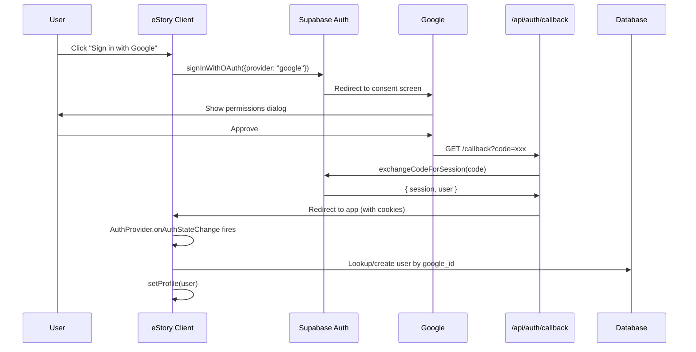

## Overview

eStory integrates **Google OAuth** through Supabase Auth, providing a traditional social login option alongside Web3 wallet authentication. This allows users without crypto wallets to access the platform using their Google accounts.

### Why Google OAuth?

<CardGroup cols={2}>
  <Card title="Onboarding Simplicity" icon="user-plus">
    Familiar login experience reduces friction for non-Web3 users
  </Card>
  <Card title="Email Verification" icon="envelope-circle-check">
    Google accounts are pre-verified, no additional confirmation needed
  </Card>
  <Card title="Session Management" icon="clock-rotate-left">
    Automatic token refresh and session persistence via Supabase
  </Card>
  <Card title="Account Linking" icon="link">
    Users can later add a wallet to enable Web3 features
  </Card>
</CardGroup>

## OAuth Flow



## Supabase OAuth Configuration

### Environment Setup

Configure Supabase OAuth in `.env.local`:

```bash
NEXT_PUBLIC_SUPABASE_URL=https://your-project.supabase.co
NEXT_PUBLIC_SUPABASE_ANON_KEY=eyJhbGciOiJIUzI1NiIsInR5cCI6IkpXVCJ9...
SUPABASE_SERVICE_ROLE_KEY=eyJhbGciOiJIUzI1NiIsInR5cCI6IkpXVCJ9...
```

### Supabase Dashboard Setup

<Steps>
  <Step title="Enable Google Provider">
    1. Go to **Authentication** → **Providers** in Supabase dashboard
    2. Enable **Google** provider
    3. Add Google OAuth credentials (Client ID, Client Secret)
  </Step>
  
  <Step title="Configure Redirect URLs">
    Add authorized redirect URLs:
    
    - Development: `http://localhost:3000/api/auth/callback`
    - Production: `https://yourdomain.com/api/auth/callback`
  </Step>
  
  <Step title="Set Site URL">
    Configure the site URL in **Authentication** → **URL Configuration**:
    
    - Site URL: `https://yourdomain.com`
    - Redirect URLs: `https://yourdomain.com/**`
  </Step>
</Steps>

## Client-Side Integration

### Sign In with Google

The AuthProvider exposes a `signInWithGoogle()` method:

```typescript
// components/AuthProvider.tsx:620
const signInWithGoogle = useCallback(async () => {
  if (!supabase) return;
  
  await supabase.auth.signInWithOAuth({
    provider: "google",
    options: {
      redirectTo: `${window.location.origin}/api/auth/callback`,
    },
  });
}, [supabase]);
```

### Usage in Components

```typescript
import { useAuth } from "@/components/AuthProvider";

function SignInButton() {
  const { signInWithGoogle, isLoading } = useAuth();
  
  return (
    <button onClick={signInWithGoogle} disabled={isLoading}>
      <GoogleIcon />
      Sign in with Google
    </button>
  );
}
```

<Note>
The `signInWithGoogle()` call will redirect the user to Google's consent screen. After approval, Google redirects back to `/api/auth/callback`.
</Note>

## Callback Handling

The callback route handles the OAuth redirect and establishes the session.

### GET /api/auth/callback

**Endpoint**: `source/app/api/auth/callback/route.ts`

**Request** (from Google):
```http
GET /api/auth/callback?code=4/0AfJohXnN_xyz123...&scope=email+profile
```

**Response**:
```http
HTTP/1.1 302 Found
Location: https://yourdomain.com/
Set-Cookie: sb-access-token=...; HttpOnly; Secure; SameSite=Lax
Set-Cookie: sb-refresh-token=...; HttpOnly; Secure; SameSite=Lax
```

### Implementation

<Steps>
  <Step title="Extract Authorization Code">
    ```typescript
    const { searchParams, origin } = new URL(req.url);
    const code = searchParams.get("code");
    const next = searchParams.get("next");  // Optional redirect destination
    
    if (!code) {
      return NextResponse.redirect(`${origin}/?auth_error=missing_code`);
    }
    ```
  </Step>
  
  <Step title="Exchange Code for Session">
    ```typescript
    const supabase = await createSupabaseServerClient();
    const { error } = await supabase.auth.exchangeCodeForSession(code);
    
    if (error) {
      console.error("[AUTH CALLBACK] Code exchange failed:", error.message);
      return NextResponse.redirect(`${origin}/?auth_error=exchange_failed`);
    }
    ```
    
    This call:
    - Validates the authorization code with Google
    - Creates a Supabase session
    - Sets HTTP-only cookies with access/refresh tokens
  </Step>
  
  <Step title="Validate Redirect URL">
    Security check: prevent open redirects
    
    ```typescript
    const ALLOWED_REDIRECT_PATHS = [
      '/', '/profile', '/record', '/social', '/library', '/books', '/tracker'
    ];
    
    function isAllowedRedirect(url: string, origin: string): boolean {
      try {
        const parsed = new URL(url);
        const originParsed = new URL(origin);
        
        // Must be same origin
        if (parsed.origin !== originParsed.origin) return false;
        
        // Must be an allowed path
        return ALLOWED_REDIRECT_PATHS.some(path => 
          parsed.pathname === path || parsed.pathname.startsWith(path + '/')
        );
      } catch {
        return false;
      }
    }
    ```
  </Step>
  
  <Step title="Redirect to App">
    ```typescript
    if (next && isAllowedRedirect(`${origin}${next}`, origin)) {
      return NextResponse.redirect(`${origin}${next}`);
    }
    
    return NextResponse.redirect(origin);  // Default to homepage
    ```
  </Step>
</Steps>

### Redirect Whitelist

The callback enforces a **redirect whitelist** to prevent open redirect attacks:

<Warning>
**Security Risk**: Without a whitelist, an attacker could construct a malicious URL like:

`/api/auth/callback?code=...&next=https://evil.com/phishing`

This would redirect authenticated users to a phishing site with valid session cookies.
</Warning>

**Allowed Paths**:
- `/` - Homepage
- `/profile` - User profile
- `/record` - Voice recording page
- `/social` - Social feed
- `/library` - Story library
- `/books` - NFT books
- `/tracker` - Habit tracker

**Validation Rules**:
1. **Same origin**: Redirect URL must match the app's origin
2. **Path prefix match**: Redirect path must match or be a subpath of an allowed path
3. **No query string tricks**: The URL parser handles encoded characters safely

## Session Hydration

After the callback redirect, the AuthProvider picks up the session automatically.

### Auth State Listener

```typescript
// components/AuthProvider.tsx:313
useEffect(() => {
  if (!supabase) return;
  
  const { data: { subscription } } = supabase.auth.onAuthStateChange(
    async (event, session) => {
      if (event === "SIGNED_IN" && session) {
        const provider = session.user.app_metadata?.provider;
        
        if (provider === "google") {
          await handleGoogleSignIn(session);
          return;
        }
      }
      
      if (event === "SIGNED_OUT") {
        setProfile(null);
        return;
      }
    }
  );
  
  return () => subscription.unsubscribe();
}, [supabase]);
```

### Google Sign-In Handler

The `handleGoogleSignIn()` function implements a **priority-based lookup** to handle various account states:

```typescript
// components/AuthProvider.tsx:123
async function handleGoogleSignIn(session: Session) {
  const user = session.user;
  const googleId = user.identities?.[0]?.id ?? user.id;
  
  // PRIORITY 1: Secure linking token (wallet user initiated "Link Google")
  const linkingToken = sessionStorage.getItem("googleLinkingToken");
  if (linkingToken) {
    // Link this Google account to existing wallet account
    const res = await fetch("/api/auth/link-google", {
      method: "POST",
      body: JSON.stringify({ linkingToken, googleId, ... }),
    });
    // ... (see Account Linking docs)
  }
  
  // PRIORITY 2: Lookup by Supabase auth user ID (returning Google user)
  const { data: existing } = await supabase
    .from("users")
    .select("*")
    .eq("id", user.id)
    .maybeSingle();
  
  if (existing) {
    setUnifiedProfile(existing, user);
    return;
  }
  
  // PRIORITY 3: Lookup by google_id (account was merged, ID differs)
  const { data: byGoogleId } = await supabase
    .from("users")
    .select("*")
    .eq("google_id", googleId)
    .maybeSingle();
  
  if (byGoogleId) {
    setUnifiedProfile(byGoogleId, user);
    return;
  }
  
  // PRIORITY 4: Auto-link by email (same email proves ownership)
  const userEmail = user.email;
  if (userEmail) {
    const { data: emailMatch } = await supabase
      .from("users")
      .select("*")
      .eq("email", userEmail)
      .maybeSingle();
    
    if (emailMatch && !emailMatch.google_id) {
      // Auto-link: same email proves the user owns both accounts
      await supabase
        .from("users")
        .update({
          google_id: googleId,
          auth_provider: emailMatch.wallet_address ? "both" : "google",
        })
        .eq("id", emailMatch.id);
      
      return;
    }
  }
  
  // PRIORITY 5: Create new Google-only user (fresh Google sign-up)
  const { data: created } = await supabase
    .from("users")
    .upsert({
      id: user.id,
      name: user.user_metadata?.full_name ?? user.user_metadata?.name,
      email: user.email,
      avatar: user.user_metadata?.avatar_url,
      google_id: googleId,
      auth_provider: "google",
      is_onboarded: true,  // Google users skip onboarding
      wallet_address: null,
    }, { onConflict: "id" })
    .select()
    .maybeSingle();
  
  setUnifiedProfile(created, user);
}
```

### Priority Explanation

The handler checks multiple scenarios in priority order:

| Priority | Scenario | Action |
|----------|----------|--------|
| **1** | **Linking token exists** | Link this Google account to existing wallet user (secure flow) |
| **2** | **User ID match** | Returning Google user (most common) |
| **3** | **Google ID match** | Account was merged but Supabase ID changed |
| **4** | **Email match** | Auto-link if email matches and no Google ID set (same email = ownership proof) |
| **5** | **No match** | New Google user - create account with `is_onboarded: true` |

<Note>
**Why skip onboarding for Google users?**

Wallet users need onboarding to set username/avatar since we only have their wallet address. Google users already provide name, email, and avatar through OAuth, so they can skip onboarding.
</Note>

## Session Management

### Cookie Storage

Supabase stores session tokens in HTTP-only cookies (set by `createSupabaseServerClient()`):

```typescript
// Cookies set by Supabase:
sb-access-token: eyJhbGciOiJIUzI1NiIsInR5cCI6IkpXVCJ9...  // 1 hour expiry
sb-refresh-token: v1.eyJhbGciOiJIUzI1NiIsInR5cCI6IkpXVCJ9...  // 30 days expiry
```

**Security Features**:
- `HttpOnly`: Not accessible via JavaScript (XSS protection)
- `Secure`: Only sent over HTTPS
- `SameSite=Lax`: CSRF protection

### Token Refresh

Supabase automatically refreshes tokens before expiry:

```typescript
// Automatic refresh (handled by Supabase SDK)
const { data: { session } } = await supabase.auth.getSession();
// If access token is expired but refresh token is valid,
// Supabase automatically requests a new access token
```

### Manual Session Check

Components can check session status:

```typescript
const { profile, isLoading } = useAuth();

if (isLoading) {
  return <LoadingSpinner />;
}

if (!profile) {
  return <SignInPrompt />;
}

// User is authenticated
return <ProtectedContent user={profile} />;
```

## User Metadata

Google OAuth provides rich user metadata:

```typescript
interface GoogleUserMetadata {
  avatar_url: string;       // Profile picture URL
  email: string;            // Verified email
  email_verified: boolean;  // Always true for Google
  full_name: string;        // "John Doe"
  iss: string;              // "https://accounts.google.com"
  name: string;             // "John Doe"
  picture: string;          // Profile picture URL (duplicate of avatar_url)
  provider_id: string;      // Google user ID
  sub: string;              // Google user ID
}

// Access in session:
const session = await supabase.auth.getSession();
const metadata = session.data.session?.user.user_metadata;
```

### Mapping to eStory Profile

```typescript
// components/AuthProvider.tsx:236
const { data: created } = await supabase
  .from("users")
  .upsert({
    id: user.id,
    name: user.user_metadata?.full_name ?? user.user_metadata?.name,  // Google name
    email: user.email,                                                // Google email
    avatar: user.user_metadata?.avatar_url,                           // Google avatar
    google_id: googleId,                                              // Google user ID
    auth_provider: "google",
    is_onboarded: true,
  });
```

## Error Handling

### Callback Errors

The callback route handles multiple error scenarios:

```typescript
export async function GET(req: NextRequest) {
  const { searchParams, origin } = new URL(req.url);
  const code = searchParams.get("code");
  
  // Error 1: Missing code
  if (!code) {
    return NextResponse.redirect(`${origin}/?auth_error=missing_code`);
  }
  
  try {
    const supabase = await createSupabaseServerClient();
    const { error } = await supabase.auth.exchangeCodeForSession(code);
    
    // Error 2: Code exchange failed
    if (error) {
      console.error("[AUTH CALLBACK] Code exchange failed:", error.message);
      return NextResponse.redirect(`${origin}/?auth_error=exchange_failed`);
    }
    
    return NextResponse.redirect(origin);
  } catch (err) {
    // Error 3: Unexpected error
    console.error("[AUTH CALLBACK] Unexpected error:", err);
    return NextResponse.redirect(`${origin}/?auth_error=true`);
  }
}
```

### Client-Side Error Handling

```typescript
function SignInPage() {
  const router = useRouter();
  const searchParams = useSearchParams();
  const authError = searchParams.get("auth_error");
  
  useEffect(() => {
    if (authError) {
      const errorMessages = {
        missing_code: "OAuth code was missing. Please try again.",
        exchange_failed: "Failed to establish session. Please try again.",
        true: "An authentication error occurred. Please try again.",
      };
      
      toast.error(errorMessages[authError] || "Authentication failed");
    }
  }, [authError]);
  
  // ...
}
```

## Security Considerations

<CardGroup cols={2}>
  <Card title="Redirect Whitelist" icon="shield-check">
    Always validate redirect URLs to prevent open redirect attacks
  </Card>
  
  <Card title="HTTPS Only" icon="lock">
    OAuth tokens are sensitive - enforce HTTPS in production
  </Card>
  
  <Card title="State Parameter" icon="fingerprint">
    Supabase includes a state parameter to prevent CSRF attacks
  </Card>
  
  <Card title="Nonce Validation" icon="shield-halved">
    Supabase validates the nonce to prevent replay attacks
  </Card>
</CardGroup>

### PKCE Flow

Supabase uses **PKCE (Proof Key for Code Exchange)** for OAuth:

1. **Client** generates random `code_verifier` and derives `code_challenge`
2. **Authorization request** includes `code_challenge`
3. **Token request** includes `code_verifier`
4. **Server** verifies that `code_verifier` matches the original `code_challenge`

This prevents authorization code interception attacks.

## Testing

### Manual Testing

<Steps>
  <Step title="Start Dev Server">
    ```bash
    npm run dev
    ```
  </Step>
  
  <Step title="Click Sign In">
    Navigate to the app and click "Sign in with Google"
  </Step>
  
  <Step title="Verify Redirect">
    Ensure redirect goes to `http://localhost:3000/api/auth/callback?code=...`
  </Step>
  
  <Step title="Check Profile">
    After redirect, verify profile is set in AuthProvider:
    
    ```typescript
    const { profile } = useAuth();
    console.log(profile);  // Should include Google user data
    ```
  </Step>
</Steps>

### E2E Testing

```typescript
import { test, expect } from "@playwright/test";

test("Google OAuth flow", async ({ page }) => {
  await page.goto("http://localhost:3000");
  
  // Click sign in button
  await page.click('button:has-text("Sign in with Google")');
  
  // Wait for Google redirect
  await page.waitForURL(/accounts\.google\.com/);
  
  // Fill Google credentials (test account)
  await page.fill('input[type="email"]', process.env.TEST_GOOGLE_EMAIL);
  await page.click('button:has-text("Next")');
  await page.fill('input[type="password"]', process.env.TEST_GOOGLE_PASSWORD);
  await page.click('button:has-text("Next")');
  
  // Wait for redirect back to app
  await page.waitForURL("http://localhost:3000/");
  
  // Verify profile is loaded
  await expect(page.locator('[data-testid="user-profile"]')).toBeVisible();
});
```

## Next Steps

<CardGroup cols={2}>
  <Card title="Account Linking" icon="link" href="/auth/account-linking">
    Link Google and wallet accounts securely
  </Card>
  <Card title="Wallet Auth" icon="wallet" href="/auth/wallet-auth">
    Learn about Web3 wallet authentication
  </Card>
  <Card title="API Reference" icon="code" href="/api/auth">
    Full API endpoint documentation
  </Card>
</CardGroup>
