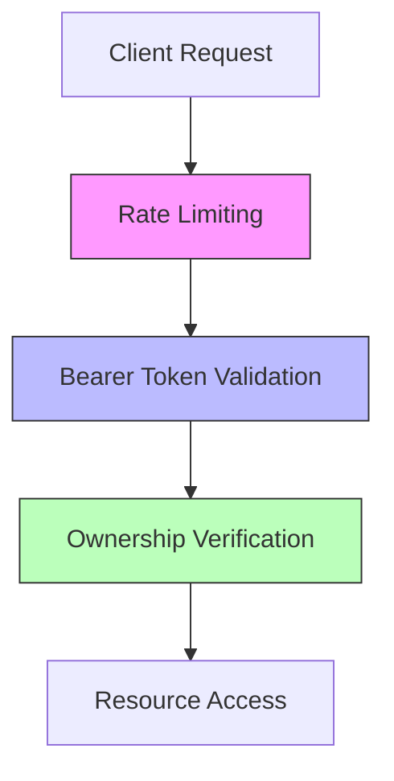
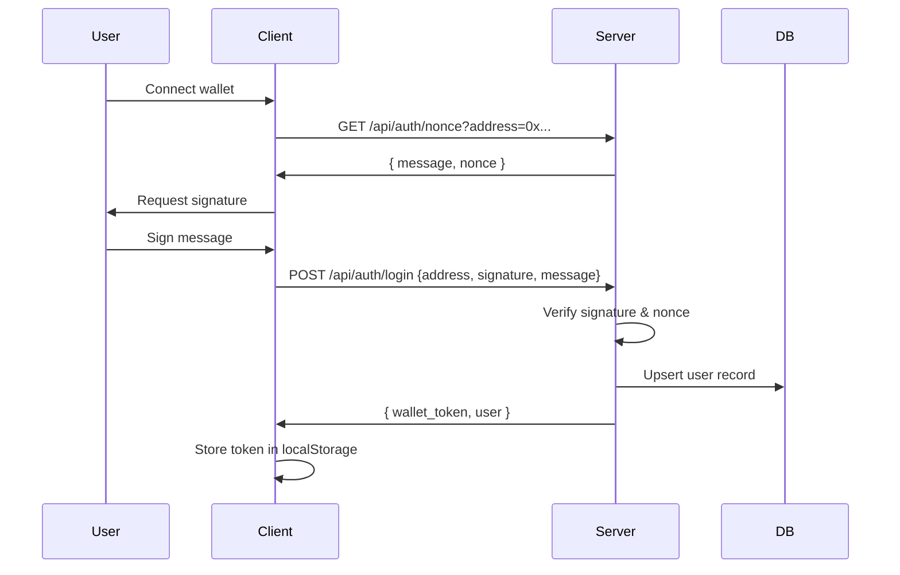
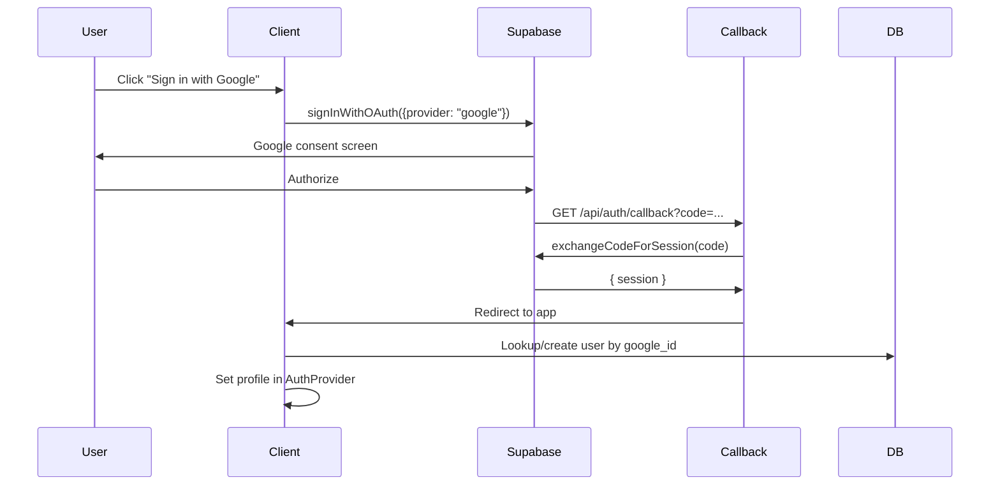

## Architecture

eStory implements a **dual authentication system** that supports both Web3 wallet-based authentication and traditional Google OAuth, allowing users to choose their preferred login method or link both for maximum flexibility.

### Authentication Methods

<CardGroup cols={2}>
  <Card title="Wallet Authentication" icon="wallet">
    Sign in with Ethereum wallet using signature verification
  </Card>
  <Card title="Google OAuth" icon="google">
    Sign in with Google account via Supabase Auth
  </Card>
</CardGroup>

### Security Model

The authentication system is built on a **layered security architecture**:



**Security Layers:**

1. **Layer 0**: Security headers (CSP, X-Frame-Options, CORS)
2. **Layer 1**: Rate limiting (middleware.ts)
3. **Layer 2**: Bearer token authentication (JWT validation)
4. **Layer 3**: Input validation (file size, MIME types, length limits)
5. **Layer 4**: Ownership verification (user can only modify their own resources)

### Token System

<Tabs>
  <Tab title="Wallet JWT">
    **Custom JWT tokens** for wallet users (7-day expiry):
    
    ```typescript
    interface WalletTokenPayload {
      sub: string;              // User ID
      wallet: string;           // Lowercase wallet address
      auth_method: "wallet";    // Auth discriminator
      iss: "estory";           // Issuer
      aud: "estory-api";       // Audience
    }
    ```
    
    - Signed with HMAC SHA-256
    - Stored in localStorage as `estory_wallet_token`
    - Generated after signature verification in `POST /api/auth/login`
  </Tab>
  
  <Tab title="Supabase JWT">
    **Supabase session tokens** for Google OAuth users:
    
    - Managed automatically by Supabase Auth
    - Stored in HTTP-only cookies
    - Auto-refreshed before expiry
    - Includes user metadata (email, avatar, google_id)
  </Tab>
</Tabs>

## AuthProvider

The `AuthProvider` component (source/components/AuthProvider.tsx:56) orchestrates all authentication flows and provides a unified context to the app.

### Context API

```typescript
interface AuthContextType {
  profile: UnifiedUserProfile | null;
  isLoading: boolean;
  needsOnboarding: boolean;
  getAccessToken: () => Promise<string | null>;
  signInWithGoogle: () => Promise<void>;
  signOut: () => Promise<void>;
  completeOnboarding: (data: OnboardingData) => Promise<void>;
  refreshProfile: () => Promise<void>;
}
```

### Unified User Profile

The AuthProvider merges wallet and OAuth data into a single profile:

```typescript
interface UnifiedUserProfile {
  id: string;                           // Supabase user ID or generated UUID
  name: string | null;
  username: string | null;
  email: string | null;
  avatar: string | null;
  wallet_address: string | null;        // Lowercase Ethereum address
  balance: string;                      // ETH balance from wagmi
  isConnected: boolean;                 // Wallet connection status
  supabaseUser: User | null;            // Supabase auth user (if OAuth)
  auth_provider: "wallet" | "google" | "both";
  is_onboarded: boolean;
  google_id: string | null;             // Google OAuth ID
}
```

### Token Priority

The `getAccessToken()` method uses a fallback chain:

<Steps>
  <Step title="Check Supabase Session">
    First priority: Supabase JWT (for Google users)
    
    ```typescript
    const { data } = await supabase.auth.getSession();
    if (data?.session?.access_token) return token;
    ```
  </Step>
  
  <Step title="Check Wallet JWT">
    Second priority: Stored wallet token
    
    ```typescript
    const walletToken = localStorage.getItem("estory_wallet_token");
    if (walletToken) return walletToken;
    ```
  </Step>
  
  <Step title="Return Null">
    No valid token found - user must authenticate
  </Step>
</Steps>

## Nonce-Based Signing

Web3 wallet authentication uses **nonce-based signature verification** to prevent replay attacks.

### How Nonces Work

<Note>
A nonce (number used once) is a server-generated UUID that ensures each signature is unique and can only be used once.
</Note>

```typescript
// Nonce lifecycle
const nonce = randomUUID();           // Generated server-side
const expiry = Date.now() + 5 * 60 * 1000;  // 5-minute TTL
nonceStore.set(address, { nonce, createdAt: Date.now() });
```

### Replay Attack Prevention

The nonce system prevents attackers from reusing captured signatures:

1. **One-time use**: Each nonce is consumed immediately after verification
2. **Time-limited**: Nonces expire after 5 minutes
3. **Address-bound**: Each wallet address has its own nonce
4. **Embedded in message**: The signed message contains the nonce, timestamp, and expiry

```typescript
// Nonce verification (source/lib/nonce.ts:21)
export function verifyNonce(address: string, message: string) {
  const entry = nonceStore.get(address.toLowerCase());
  
  if (!entry) {
    return { valid: false, error: "No nonce found" };
  }
  
  if (Date.now() - entry.createdAt > NONCE_EXPIRY_MS) {
    nonceStore.delete(address);
    return { valid: false, error: "Nonce expired" };
  }
  
  if (!message.includes(`Nonce: ${entry.nonce}`)) {
    return { valid: false, error: "Invalid nonce" };
  }
  
  // Consume the nonce (one-time use)
  nonceStore.delete(address);
  return { valid: true };
}
```

<Warning>
**Production Deployment**: The in-memory nonce store does not work across multiple server instances. Use Redis or a database table for production multi-instance deployments.
</Warning>

## Session Management

### Wallet Session Lifecycle



### Google OAuth Lifecycle



### Sign Out

Sign out clears **both** session types and vault encryption keys:

```typescript
const signOut = useCallback(async () => {
  await supabase.auth.signOut();  // Clear Supabase session
  localStorage.removeItem(WALLET_TOKEN_KEY);  // Clear wallet JWT
  
  // Clear vault DEKs from memory
  const { clearAllKeys } = await import("@/lib/vault");
  clearAllKeys();
  
  setProfile(null);
  setNeedsOnboarding(false);
}, [supabase]);
```

## API Authentication

All protected API routes use `validateAuthOrReject()` from `lib/auth.ts`:

```typescript
import { validateAuthOrReject, isAuthError } from "@/lib/auth";

export async function POST(req: NextRequest) {
  const authResult = await validateAuthOrReject(req);
  if (isAuthError(authResult)) return authResult;
  
  const authenticatedUserId = authResult;  // Type: string
  
  // ... route logic with guaranteed authenticated user
}
```

### Validation Flow

The validator checks both token types:

<Steps>
  <Step title="Extract Bearer Token">
    ```typescript
    const authHeader = req.headers.get("authorization");
    if (!authHeader?.startsWith("Bearer ")) {
      return NextResponse.json({ error: "Unauthorized" }, { status: 401 });
    }
    ```
  </Step>
  
  <Step title="Try Supabase JWT">
    Verify with Supabase Auth (for Google users)
  </Step>
  
  <Step title="Try Wallet JWT">
    Verify with custom JWT library (for wallet users)
  </Step>
  
  <Step title="Return User ID">
    Return authenticated user ID on success
  </Step>
</Steps>

## Next Steps

<CardGroup cols={2}>
  <Card title="Wallet Authentication" icon="wallet" href="/auth/wallet-auth">
    Deep dive into Web3 wallet authentication flow
  </Card>
  <Card title="Google OAuth" icon="google" href="/auth/oauth">
    Learn about Google OAuth integration
  </Card>
  <Card title="Account Linking" icon="link" href="/auth/account-linking">
    Link wallet and Google accounts securely
  </Card>
</CardGroup>
