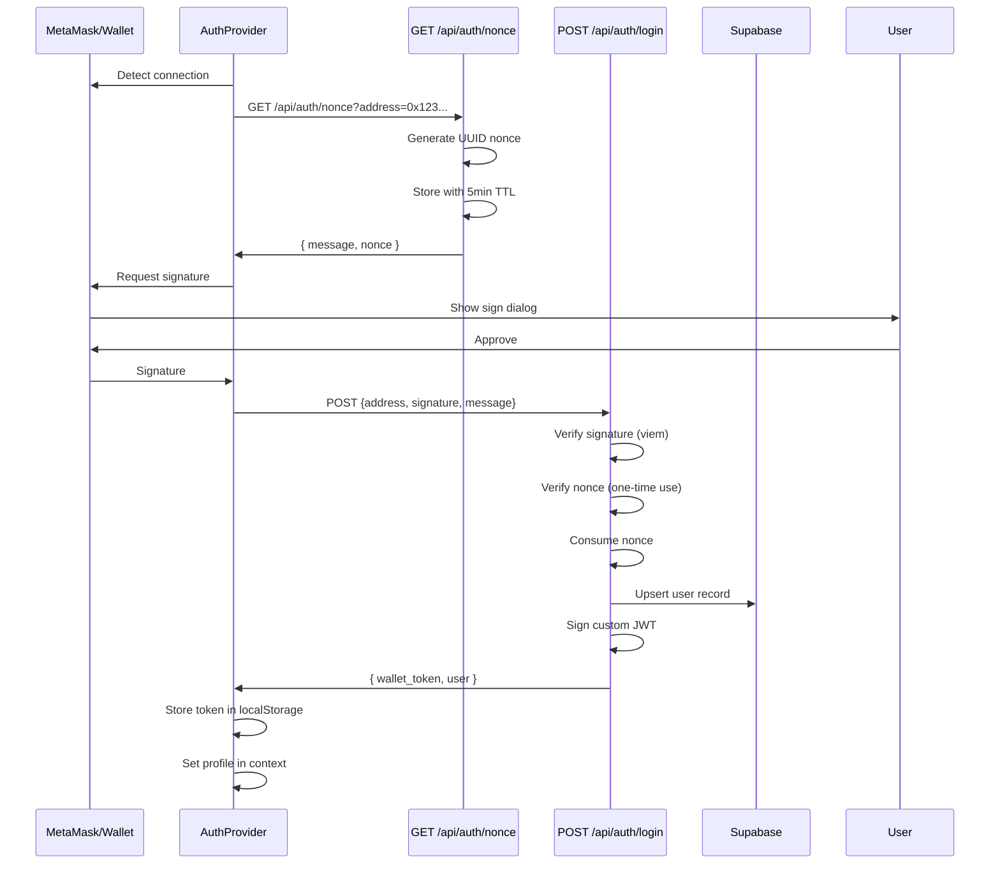

## Overview

eStory uses **cryptographic signature verification** to authenticate users with their Ethereum wallets. This approach eliminates passwords while providing strong security through public-key cryptography.

### Why Wallet Authentication?

<CardGroup cols={2}>
  <Card title="No Passwords" icon="shield-check">
    Users sign a message with their private key instead of managing passwords
  </Card>
  <Card title="Cryptographically Secure" icon="lock">
    ECDSA signatures are mathematically verifiable and impossible to forge
  </Card>
  <Card title="Self-Sovereign" icon="user-shield">
    Users control their identity through wallet ownership
  </Card>
  <Card title="Web3 Native" icon="ethereum">
    Seamless integration with blockchain features (NFTs, tokens, tips)
  </Card>
</CardGroup>

## Authentication Flow



## RainbowKit Integration

eStory uses [RainbowKit](https://www.rainbowkit.com/) for wallet connection UI and management.

### Provider Setup

The wallet providers are initialized in `components/Provider.tsx`:

```typescript
import { WagmiProvider } from "wagmi";
import { RainbowKitProvider } from "@rainbow-me/rainbowkit";
import { QueryClientProvider } from "@tanstack/react-query";
import { wagmiConfig } from "@/lib/wagmi";

export default function Provider({ children }: { children: React.ReactNode }) {
  return (
    <WagmiProvider config={wagmiConfig}>
      <QueryClientProvider client={queryClient}>
        <RainbowKitProvider>
          <AuthProvider>
            {children}
          </AuthProvider>
        </RainbowKitProvider>
      </QueryClientProvider>
    </WagmiProvider>
  );
}
```

### Wagmi Configuration

The wagmi config (`lib/wagmi.ts`) defines supported chains and connectors:

```typescript
import { getDefaultConfig } from "@rainbow-me/rainbowkit";
import { base, baseSepolia } from "wagmi/chains";

export const wagmiConfig = getDefaultConfig({
  appName: "eStory",
  projectId: process.env.NEXT_PUBLIC_WALLETCONNECT_PROJECT_ID!,
  chains: [base, baseSepolia],
  ssr: true,
});
```

### Wallet Detection

The AuthProvider uses wagmi hooks to detect wallet connections:

```typescript
import { useAccount, useSignMessage } from "wagmi";

const { address, isConnected } = useAccount();
const { signMessageAsync } = useSignMessage();

useEffect(() => {
  if (!isConnected || !address) return;
  if (profile) return;  // Already authenticated
  
  // Trigger wallet login flow
  handleWalletLogin(address);
}, [isConnected, address, profile]);
```

<Note>
The wallet login flow is **NOT triggered** if a Google OAuth session exists. Users must explicitly click "Link Wallet" to add a wallet to their Google account.
</Note>

## Nonce Generation

The nonce endpoint generates a unique, time-limited challenge for each wallet address.

### GET /api/auth/nonce

**Endpoint**: `source/app/api/auth/nonce/route.ts`

**Request**:
```http
GET /api/auth/nonce?address=0x742d35Cc6634C0532925a3b844Bc9e7595f0bEb
```

**Response**:
```json
{
  "message": "Welcome to EStory\n\nSign this message to log in securely.\n\nSite: eStory\nAddress: 0x742d35cc6634c0532925a3b844bc9e7595f0beb\n\nNo transaction · No gas fees · Completely free\n\nNonce: f7a3b2c1-8d4e-4f9a-b6c5-2e1d3a4b5c6d\nTimestamp: 2026-03-03T10:30:00.000Z\nExpires: 2026-03-03T10:35:00.000Z",
  "nonce": "f7a3b2c1-8d4e-4f9a-b6c5-2e1d3a4b5c6d"
}
```

### Implementation

<Steps>
  <Step title="Validate Address">
    ```typescript
    const address = searchParams.get("address")?.toLowerCase();
    if (!address) {
      return NextResponse.json({ error: "Missing address parameter" }, { status: 400 });
    }
    ```
  </Step>
  
  <Step title="Clean Up Expired Nonces">
    ```typescript
    cleanupExpiredNonces();  // Remove old nonces from memory
    ```
  </Step>
  
  <Step title="Generate Nonce">
    ```typescript
    import { randomUUID } from "crypto";
    
    const nonce = randomUUID();  // Cryptographically random UUID
    const timestamp = new Date().toISOString();
    const expiresAt = new Date(Date.now() + NONCE_EXPIRY_MS).toISOString();
    ```
  </Step>
  
  <Step title="Store Nonce">
    ```typescript
    // In-memory store (use Redis for production)
    storeNonce(address, nonce);
    ```
  </Step>
  
  <Step title="Build Message">
    ```typescript
    const message = `Welcome to EStory

Sign this message to log in securely.

Site: eStory
Address: ${address}

No transaction · No gas fees · Completely free

Nonce: ${nonce}
Timestamp: ${timestamp}
Expires: ${expiresAt}`;
    ```
  </Step>
</Steps>

### Message Format

The signed message includes:

| Field | Purpose |
|-------|---------|
| **Welcome text** | User-friendly explanation |
| **Site name** | Prevent phishing (user verifies domain) |
| **Address** | Bind signature to specific wallet |
| **"No transaction"** | Assure user no gas fees will be charged |
| **Nonce** | Unique identifier for replay prevention |
| **Timestamp** | When the nonce was issued |
| **Expires** | When the nonce expires (5 minutes) |

<Warning>
The message text is **not encrypted**. Never include sensitive information in the nonce message.
</Warning>

## Signature Verification

The login endpoint verifies the wallet signature and issues a JWT token.

### POST /api/auth/login

**Endpoint**: `source/app/api/auth/login/route.ts`

**Request**:
```typescript
POST /api/auth/login
Content-Type: application/json

{
  "address": "0x742d35cc6634c0532925a3b844bc9e7595f0beb",
  "signature": "0x7f8c9d2e3f4a5b6c7d8e9f0a1b2c3d4e5f6a7b8c9d0e1f2a3b4c5d6e7f8a9b0c1d2e3f4a5b6c7d8e9f0a1b2c3d4e5f6a7b8c9d0e1f2a3b4c5d6e7f8a9b0c1b",
  "message": "Welcome to EStory\n\n..."
}
```

**Response**:
```json
{
  "success": true,
  "user": {
    "id": "uuid-here",
    "wallet_address": "0x742d35cc6634c0532925a3b844bc9e7595f0beb",
    "auth_provider": "wallet",
    "is_onboarded": false
  },
  "wallet_token": "eyJhbGciOiJIUzI1NiIsInR5cCI6IkpXVCJ9..."
}
```

### Implementation

<Steps>
  <Step title="Input Validation">
    ```typescript
    const { address, signature, message } = await req.json();
    
    if (!address || !signature || !message) {
      return NextResponse.json(
        { error: "Missing required fields" },
        { status: 400 }
      );
    }
    
    if (typeof signature !== "string" || !isHex(signature)) {
      return NextResponse.json(
        { error: "Invalid signature format" },
        { status: 400 }
      );
    }
    ```
  </Step>
  
  <Step title="Verify Signature">
    Use viem's `verifyMessage` to check the cryptographic signature:
    
    ```typescript
    import { verifyMessage, type Address } from "viem";
    
    const isValid = await verifyMessage({
      address: address as Address,
      message,
      signature: signature as `0x${string}`,
    });
    
    if (!isValid) {
      return NextResponse.json(
        { error: "Signature verification failed" },
        { status: 401 }
      );
    }
    ```
  </Step>
  
  <Step title="Verify Nonce">
    Check that the nonce is valid and consume it:
    
    ```typescript
    import { verifyNonce } from "@/lib/nonce";
    
    const nonceResult = verifyNonce(address, message);
    if (!nonceResult.valid) {
      return NextResponse.json(
        { error: nonceResult.error || "Invalid nonce" },
        { status: 401 }
      );
    }
    // Nonce is automatically consumed by verifyNonce()
    ```
  </Step>
  
  <Step title="Upsert User Record">
    Create or update the user in the database:
    
    ```typescript
    const admin = createSupabaseAdminClient();
    const walletAddress = address.toLowerCase();
    
    const { data: existingUser } = await admin
      .from("users")
      .select("*")
      .eq("wallet_address", walletAddress)
      .maybeSingle();
    
    if (!existingUser) {
      const { data: created } = await admin
        .from("users")
        .insert({
          wallet_address: walletAddress,
          auth_provider: "wallet",
          is_onboarded: false,
        })
        .select()
        .single();
      
      profile = created;
    } else {
      profile = existingUser;
    }
    ```
  </Step>
  
  <Step title="Sign JWT Token">
    Generate a custom JWT for API authentication:
    
    ```typescript
    import { signWalletToken } from "@/lib/jwt";
    
    const walletToken = await signWalletToken(profile.id, walletAddress);
    ```
    
    The JWT includes:
    - `sub`: User ID
    - `wallet`: Lowercase wallet address
    - `auth_method`: "wallet"
    - `exp`: 7 days from now
  </Step>
  
  <Step title="Return Token">
    ```typescript
    return NextResponse.json({
      success: true,
      user: profile,
      wallet_token: walletToken,
    });
    ```
  </Step>
</Steps>

## Replay Attack Prevention

The nonce system prevents multiple attack vectors:

### Attack Vector 1: Signature Reuse

**Attack**: Attacker captures a valid signature and tries to replay it.

**Prevention**: Each nonce can only be used once.

```typescript
// First use: ✅ Success
verifyNonce(address, message);  // { valid: true }
nonceStore.delete(address);     // Nonce consumed

// Second use: ❌ Rejected
verifyNonce(address, message);  // { valid: false, error: "No nonce found" }
```

### Attack Vector 2: Time-Delay Replay

**Attack**: Attacker captures a signature and waits days/weeks before using it.

**Prevention**: Nonces expire after 5 minutes.

```typescript
const NONCE_EXPIRY_MS = 5 * 60 * 1000;  // 5 minutes

if (Date.now() - entry.createdAt > NONCE_EXPIRY_MS) {
  nonceStore.delete(address);
  return { valid: false, error: "Nonce expired" };
}
```

### Attack Vector 3: Cross-Account Replay

**Attack**: Attacker tries to use a signature from Alice's wallet to authenticate as Bob.

**Prevention**: The wallet address is embedded in the signed message and verified.

```typescript
const message = `Address: ${address}\nNonce: ${nonce}`;

// Signature is cryptographically bound to the address
await verifyMessage({
  address: alice.address,   // Must match the signer
  message,                  // Contains alice.address
  signature,                // Signed by alice's private key
});
```

### Attack Vector 4: Message Tampering

**Attack**: Attacker modifies the message after the user signs it.

**Prevention**: Any change to the message invalidates the signature.

```typescript
// User signed: "Nonce: abc123"
const originalMessage = "Nonce: abc123";
const signature = await wallet.signMessage(originalMessage);

// Attacker tries: "Nonce: xyz789"
const tamperedMessage = "Nonce: xyz789";

// ❌ Verification fails
await verifyMessage({
  address: wallet.address,
  message: tamperedMessage,  // Different from signed message
  signature,                 // Signature doesn't match
});  // Returns false
```

## Client-Side Integration

### Using AuthProvider

Components access wallet auth through the `useAuth()` hook:

```typescript
import { useAuth } from "@/components/AuthProvider";

function ProfileButton() {
  const { profile, isLoading, signOut } = useAuth();
  
  if (isLoading) return <Spinner />;
  
  if (!profile) {
    return <ConnectButton />;  // RainbowKit button
  }
  
  return (
    <div>
      <p>Connected: {profile.wallet_address}</p>
      <button onClick={signOut}>Disconnect</button>
    </div>
  );
}
```

### Making Authenticated Requests

Use `getAccessToken()` to include the JWT in API calls:

```typescript
const { getAccessToken } = useAuth();

async function saveStory(story: Story) {
  const token = await getAccessToken();
  
  const response = await fetch("/api/stories", {
    method: "POST",
    headers: {
      "Content-Type": "application/json",
      ...(token ? { Authorization: `Bearer ${token}` } : {}),
    },
    body: JSON.stringify(story),
  });
  
  if (!response.ok) throw new Error("Failed to save story");
  return response.json();
}
```

## Security Best Practices

<CardGroup cols={2}>
  <Card title="Never Trust Client Input" icon="shield-exclamation">
    Always verify signatures server-side. Never rely on client-side validation alone.
  </Card>
  
  <Card title="Use HTTPS Only" icon="lock">
    Wallet signatures are NOT encrypted. Always use HTTPS to prevent MITM attacks.
  </Card>
  
  <Card title="Implement Rate Limiting" icon="gauge-high">
    Limit nonce generation and login attempts to prevent DoS attacks.
  </Card>
  
  <Card title="Monitor Nonce Store" icon="chart-line">
    In production, use Redis with TTL for automatic cleanup and multi-instance support.
  </Card>
</CardGroup>

### Error Handling

Never leak sensitive information in error messages:

```typescript
// ❌ Bad: Reveals internal details
return NextResponse.json(
  { error: error.message },  // "Database connection failed at 10.0.0.5"
  { status: 500 }
);

// ✅ Good: Generic message, log details server-side
console.error("[LOGIN] Database error:", error);
return NextResponse.json(
  { error: "Internal server error" },
  { status: 500 }
);
```

## Testing

### Unit Tests

Test signature verification with known keypairs:

```typescript
import { describe, it, expect } from "vitest";
import { verifyMessage } from "viem";
import { privateKeyToAccount } from "viem/accounts";

describe("Wallet Authentication", () => {
  it("verifies valid signature", async () => {
    const account = privateKeyToAccount("0x...");
    const message = "Test message";
    const signature = await account.signMessage({ message });
    
    const isValid = await verifyMessage({
      address: account.address,
      message,
      signature,
    });
    
    expect(isValid).toBe(true);
  });
  
  it("rejects tampered message", async () => {
    const account = privateKeyToAccount("0x...");
    const originalMessage = "Original message";
    const signature = await account.signMessage({ message: originalMessage });
    
    const isValid = await verifyMessage({
      address: account.address,
      message: "Tampered message",  // Different!
      signature,
    });
    
    expect(isValid).toBe(false);
  });
});
```

## Next Steps

<CardGroup cols={2}>
  <Card title="Google OAuth" icon="google" href="/auth/oauth">
    Learn about Google OAuth integration
  </Card>
  <Card title="Account Linking" icon="link" href="/auth/account-linking">
    Link wallet and Google accounts
  </Card>
  <Card title="API Reference" icon="code" href="/api/auth">
    Full API endpoint documentation
  </Card>
</CardGroup>
